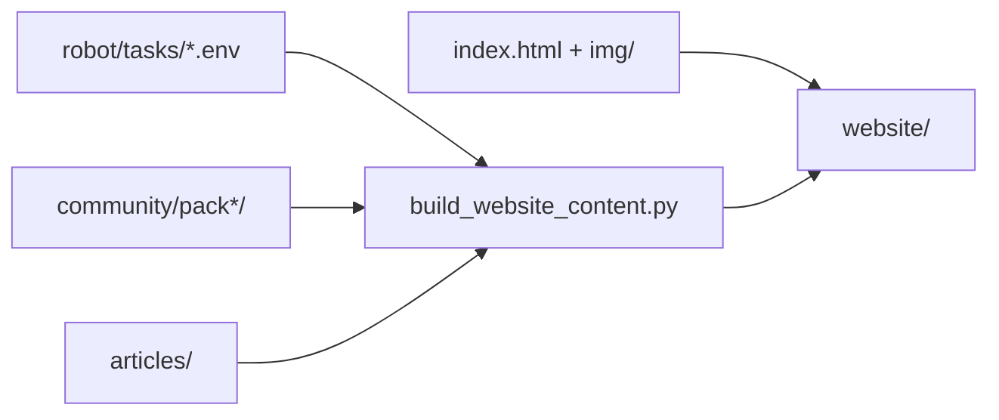

# Robot website structure (`website/`)

Static marketing and reference site for the Robot project, published at [https://robot.stepindev.com](https://robot.stepindev.com) (`SITE_BASE` in [`tools/website_content_data.py`](../tools/website_content_data.py)).

The site has two locales: **English** (`en`) and **Russian** (`ru`). English pages use `page.html`; Russian pages use `page_ru.html` (see [`page_filename()`](../tools/website_content_layout.py)).

Some files are **committed** and edited by hand; most HTML is **generated** at build time and listed in [`.gitignore`](../.gitignore).

## Committed vs generated

| In git | Generated by [`tools/build_website_content.py`](../tools/build_website_content.py) |
| ------ | ---------------------------------------------------------------------------------- |
| [`website/index.html`](../website/index.html), [`index_ru.html`](../website/index_ru.html) | `website/tasks/` (entire directory is recreated each build) |
| [`styles.css`](../website/styles.css), [`script.js`](../website/script.js), [`favicon.svg`](../website/favicon.svg) | `website/commands.html`, `commands_ru.html` |
| [`robots.txt`](../website/robots.txt), `yandex_*.html` (search-engine verification) | `website/editor.html`, `editor_ru.html` |
| [`website/img/`](../website/img/) (WebP and other assets) | `website/articles/` |
| | `website/sitemap.xml` |

Field canvas WebPs under `website/img/tasks/` are committed. English and Russian task pages share the same field images. For capture workflow and batch commands, see [`Docs/website-screenshots.md`](website-screenshots.md).

## Page map and URLs

| Page type | English | Russian |
| --------- | ------- | ------- |
| Home (landing) | `index.html` (`/`) | `index_ru.html` |
| Task catalog | `tasks/index.html` | `tasks/index_ru.html` |
| Theme hub | `tasks/<theme-slug>/index.html` | `tasks/<theme-slug>/index_ru.html` |
| Community theme hub | `tasks/community/<prefix>/<theme-slug>/index.html` | `tasks/community/<prefix>/<theme-slug>/index_ru.html` |
| Task detail | `tasks/<task_id>.html` | `tasks/<task_id>_ru.html` |
| Command reference | `commands.html` | `commands_ru.html` |
| Environment editor guide | `editor.html` | `editor_ru.html` |
| Article index | `articles/index.html` | `articles/index_ru.html` |
| Article body | `articles/<slug>/index.html` | `articles/<slug>/index_ru.html` |

### Home page

[`index.html`](../website/index.html) and [`index_ru.html`](../website/index_ru.html) are hand-maintained landing pages: hero, features, task-viewer section, lesson flow with theme links, inline command summary, localization list, and get-started steps. They link to generated catalog and reference pages.

### Task catalog and task pages

Generated from bundled task files in [`robot/tasks/`](../robot/tasks/) plus optional community packs in [`community/`](../community/) via [`TaskCatalog`](../robot/task_catalog.py) and the site-only discovery helpers in [`tools/site_catalog.py`](../tools/site_catalog.py).

- **Catalog** — all themes with links to theme hubs.
- **Community section** — bundled themes first, then one section per community pack with a single catalog card listing theme links inside, a direct download link to `{prefix}tasks.zip` via GitHub `releases/latest/download`, and links to `tasks/community/<prefix>/...`.
- **Theme hub** — task list for one topic. Public URL slugs come from [`THEME_URL_SLUG`](../tools/website_content_data.py):

  | Internal prefix | URL slug |
  | --------------- | -------- |
  | `intro` | `intro` |
  | `fun` | `functions` |
  | `for` | `for-loop` |
  | `forfun` | `for-and-functions` |
  | `w` | `while` |
  | `wfun` | `while-and-functions` |
  | `if` | `if` |
  | `wif` | `while-with-if` |
  | `ifelse` | `if-else` |
  | `compound` | `compound` |

- **Task detail** — condition text, environment figures, constraints, and prev/next navigation within the theme. HTML files live in the **root** of `website/tasks/` (e.g. `tasks/intro8.html`), not inside the theme subfolder.
- **Community theme hub** — same layout as a bundled hub, but breadcrumbs include the community pack heading, a direct download link to the pack archive, and the generated path includes the pack prefix.

### Command reference and editor guide

- **Commands** — grouped student API from [`robot/command_help.py`](../robot/command_help.py).
- **Editor** — guide to the standalone environment editor; links to constraint documentation.

### Articles

Markdown sources live under [`articles/`](../articles/). Build rules and URL slugs: [`Docs/articles.md`](articles.md).

### Sitemap

[`sitemap.xml`](../website/sitemap.xml) includes the home page, catalog, commands, editor, theme hubs, and articles (index + each published article locale). Bilingual article pages are listed with `hreflang` alternates; a single-locale article is listed once with `<loc>` only. **Individual task detail pages are not listed** (see [`collect_sitemap_urls()`](../tools/build_website_content.py)).

## Directory tree

```
website/
  index.html, index_ru.html       # landing (committed)
  styles.css, script.js, favicon.svg
  robots.txt
  img/
    hero/                         # landing OG / hero shots
    intro/, step/, all_done/      # landing feature sections
    robot_envs/, constraints/     # landing feature sections
    viewer/                       # task viewer marketing shots
    tasks/                        # field canvas for generated task pages (committed)
    task_catalog/, editor/        # previews for generated pages
    commands/                     # command reference illustrations (field legend)
  tasks/                          # generated: catalog, theme hubs, task pages
  articles/                       # generated from articles/
  commands.html, commands_ru.html # generated
  editor.html, editor_ru.html     # generated
  sitemap.xml                     # generated
```

## Data sources and build code



| Output | Source | Code |
| ------ | ------ | ---- |
| Task catalog, bundled theme hubs, task pages | `robot/tasks/*.env` | [`tools/build_website_content.py`](../tools/build_website_content.py) |
| Community catalog sections and community theme hubs | `community/pack*/` | [`tools/site_catalog.py`](../tools/site_catalog.py), [`tools/build_website_content.py`](../tools/build_website_content.py) |
| Articles | `articles/<id>/` | [`tools/article_builder.py`](../tools/article_builder.py) |
| UI strings, SEO copy, theme slugs | — | [`tools/website_content_data.py`](../tools/website_content_data.py) |
| Shared layout, breadcrumbs, `hreflang` | — | [`tools/website_content_layout.py`](../tools/website_content_layout.py) |

Task file format: [`Docs/task-env-format.md`](task-env-format.md).

## Build, preview, and deploy

Install build dependencies once:

```bash
python -m pip install -r requirements-build.txt
```

Generate all pages (same command locally and in CI):

```bash
python tools/build_website_content.py
```

[`generate_all()`](../tools/build_website_content.py) runs in this order: command reference and editor guide → task catalog → bundled theme hubs → community theme hubs → task detail pages → articles → sitemap. The `website/tasks/` directory is removed and recreated on each run.

Preview locally:

```bash
cd website && python -m http.server
```

Open `http://localhost:8000/` (or the port shown). Generated task and article pages are only available after a build.

**Deploy:** [`.github/workflows/static.yml`](../.github/workflows/static.yml) runs the build on push to `main` (when relevant paths change) and publishes the `website/` folder to GitHub Pages.

### CI path filters

The workflow `paths` list limits deploys to pushes that touch site inputs. When you add or change code that affects generated HTML, **update that list** in [`.github/workflows/static.yml`](../.github/workflows/static.yml); otherwise a merge to `main` may not redeploy.

Keep in sync:

- `tools/` modules used by [`build_website_content.py`](../tools/build_website_content.py) and its imports (layout, data, catalog, articles, community helpers, and so on)
- `robot/` modules and locale JSON read by those tools (`loader`, `command_help`, `task_todo`, `student_api`, …)
- Data sources: `robot/tasks/`, `community/`, `articles/`
- [`requirements-build.txt`](../requirements-build.txt) when build dependencies change

Screenshot tooling (`tools/capture_*.py`, [`tools/field_canvas_export.py`](../tools/field_canvas_export.py)) is not listed: it writes committed assets under `website/img/`, already covered by `website/**`.

## Related docs

- [`Docs/articles.md`](articles.md) — article folder layout, `meta.yaml`, and locale files.
- [`Docs/website-screenshots.md`](website-screenshots.md) — capturing WebP assets for `website/img/`.
- [`Docs/task-env-format.md`](task-env-format.md) — `.env` task format loaded by the site generator.
