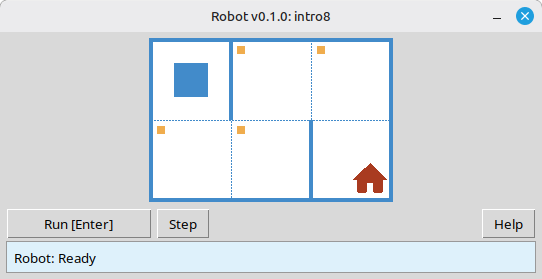

[English](./README.md) | [Русский](./readme/readme_ru.md) | [Беларуская](./readme/readme_be.md) | [Українська](./readme/readme_uk.md)

# Robot

This project is an educational **Robot** simulator for learning basic programming and algorithms. Students write short Python programs that move the Robot on a grid, paint cells, read the environment, and complete small tasks with immediate visual feedback in a desktop window.

It is intended for **school students** and anyone beginning to learn programming: sequencing, loops, conditions, and simple problem solving in a friendly, game-like setting.

## Example: task `intro8`



**Task:** Move the Robot onto the cell with the house, painting every marked cell along the way.

Sample solution in Python:

```python
from robot import *

task("intro8")

move_down()
paint()
move_right()
paint()
move_up()
paint()
move_right()
paint()
move_down()
```

## Robot commands

**move_right()**  
Moves the Robot one cell to the right.

**move_left()**  
Moves the Robot one cell to the left.

**move_up()**  
Moves the Robot one cell up.

**move_down()**  
Moves the Robot one cell down.

**paint()**  
Paints the current cell.

**is_free_left()**  
Returns True if there is no wall on the left.

**is_free_right()**  
Returns True if there is no wall on the right.

**is_free_up()**  
Returns True if there is no wall above.

**is_free_down()**  
Returns True if there is no wall below.

**is_wall_left()**  
Returns True if there is a wall on the left.

**is_wall_right()**  
Returns True if there is a wall on the right.

**is_wall_up()**  
Returns True if there is a wall above.

**is_wall_down()**  
Returns True if there is a wall below.

**is_cell_painted()**  
Returns True if the current cell is painted.

**is_cell_not_painted()**  
Returns True if the current cell is not painted.

**pol()**  
Returns the pollution value of the current cell.

**printn(value)**  
Prints an integer in the current cell.

## Available tasks for `task()`

**First steps**  
intro1, ..., intro24

**Functions**  
fun1, ..., fun20

**'for' loop**  
for1, ..., for28

**'for' loop and functions**  
forfun1, ..., forfun9

**'while' loop**  
w1, ..., w51

**'while' loop and functions**  
wfun1, ..., wfun12

**'if' statement**  
if1, ..., if14

**'while' loop with 'if'**  
wif1, ..., wif13

**'if' and 'else'**  
ifelse1, ..., ifelse12

**Compound conditions**  
compound1, ..., compound11

## Using the distributed module

1. Download the module archive from the **[GitHub Releases](https://github.com/step-in-dev/robot/releases)** page.
2. Extract the archive into the student’s working folder.
3. Save your solution file next to the `robot` package. Use **`sample_solution.py`** from the archive as a starting point.
4. To run a different exercise, change the string passed to **`task()`** (see the **Available tasks for `task()`** section above).

Requirements: **Python 3** with the standard library (the UI uses `tkinter`, which is included with most Python installations on desktop systems).
