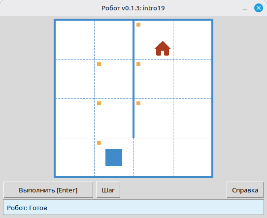
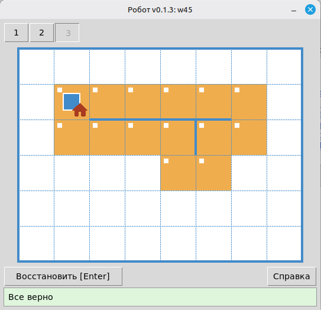

# Исполнитель Робот: что это, команды и как использовать на уроке

**Робот** — учебный исполнитель на клетчатом поле. Учащиеся пишут небольшие программы на Python: перемещают Робота, закрашивают клетки, проверяют стены и значения в клетках. Результат сразу виден в окне исполнителя, а решение проверяется автоматически.

Эта статья — для учителя информатики. Здесь собрано, **что такое классический школьный Робот**, **как он выглядит в варианте на Python**, **какие команды доступны учащимся**, **примеры программ** и **как встроить Робота в урок**.

> **Кратко:** Робот — не робототехника и не «игрушка ради Python». Это среда для тренировки **алгоритмического стиля мышления**: умения составить точный план действий и записать его так, чтобы программу выполнила ЭВМ, а не человек «по ходу дела».

---

## Зачем на уроке нужен именно Робот

Школьный курс информатики может преследовать разные цели: научить работать с офисными программами, познакомить с синтаксисом языка, показать устройство компьютера. В классической отечественной методике с учебными исполнителями главная цель другая — **развитие алгоритмического стиля мышления** как самостоятельной культурной ценности.

Алгоритмический стиль проявляется там, где человеку нужно:

1. **Заранее** продумать все шаги, а не принимать решения по ходу.
2. Записать план **без двусмысленностей** — без «и так далее», «примерно», «если что-то пойдёт не так».
3. Описать действия на **формальном языке**, понятном исполнителю, который не догадывается о намерениях автора.

Робот как раз создавался, чтобы эти трудности были **алгоритмическими**, а не техническими. В классическом курсе убирают лишнюю математику, файловую систему, компиляцию и «технические» детали; у ученика остаются здравый смысл, понятное поле и небольшой набор команд. При записи на Python для алгоритма используются короткие конструкции языка (`while`, `if`), но **команды самого Робота** по-прежнему немного, и все они про поле.

**ЭВМ и язык программирования в таком курсе — средство**, как ручка в математике. Удобное средство позволяет решать больше задач; неудобное заставляет тратить урок на «починку ручки». Модуль **Робот** задуман так, чтобы почти не отвлекать от алгоритма: скачали архив с релизов, распаковали, вызвали `task("…")`, запустили программу — и работаем с задачей.

---

## Что такое исполнитель Робот

### Учебная модель, а не настоящий робот

В методике школьного курса Робот описывают так:

- есть **клетчатое поле**;
- между клетками могут стоять **стены**;
- в одной из клеток находится **Робот** — условная машинка с пультом управления;
- на пульте — кнопки движения: вверх, вниз, влево, вправо.

Образно Робота представляют как радиоуправляемую машинку с антенной, моторами и присосками. На уроке, пока нет «Робота в металле», учитель может **играть роль исполнителя** на доске: ученик диктует команды, учитель их выполняет.

Важно: Робот — **исполнитель**, а не программист. Он **не понимает** алгоритм целиком, **не знает** циклов и условий. Он только выполняет отдельные команды и отвечает на вопросы об обстановке (стена, закраска, число в клетке). **Программу понимает и выполняет ЭВМ**: интерпретатор Python на компьютере читает код ученика и по очереди «нажимает кнопки» на пульте.

### Две схемы управления

На первых занятиях полезно постоянно противопоставлять два способа работы с исполнителем.

**Непосредственное управление.** Человек смотрит на поле, нажимает кнопку, видит результат, решает, что нажать дальше. План рождается по ходу. Даже слабый ученик легко обведёт препятствие на доске, если видит Робота.

**Программное управление.** Человек **заранее** записывает алгоритм. ЭВМ выполняет его без участия автора: отправляет команды исполнителю, получает ответы обратной связи, принимает решения по правилам программы.

Переход от первого ко второму — и есть тренировка алгоритмического мышления. Сделать самому легко; **записать** так, чтобы сработало для любой обстановки из задачи, — уже сложно.

### Откуда взялся школьный Робот

Исторически модель складывалась в конце 1970‑х — начале 1980‑х. В МГУ для первого занятия по программированию создали исполнителя **Путник** (ориентация, шаг вперёд, повороты). Для школы модель упростили: движение **вправо, влево, вверх, вниз** без понятия «куда смотрит Робот». А. Х. Шень предложил именно такую схему; с появлением экранов стены стали рисовать **между клетками**, а не занимать целую клетку.

Параллельно похожие идеи возникали в других странах — например, **Karel the Robot** в США. Суть одна: **клетчатый исполнитель без лишней математики** — естественный первый шаг к алгоритмизации.

Такой Робот стал частью отечественной школьной информатики и вошёл в среду **КуМир**. Вариант **на Python** сохраняет **ту же учебную модель**, но программы записываются на **Python**, а не на школьном алгоритмическом языке.

---

## Как выглядит Робот

На экране — окно с клетчатым полем. Видны:

- **Робот** в текущей клетке;
- **стены** между клетками и по краю поля;
- **отмеченные** клетки, которые нужно закрасить, и уже **закрашенные** (в зависимости от задачи);
- **условие задачи** и, при необходимости, **ограничения** (лимит команд, требование использовать цикл и т. п.);
- кнопки **Выполнить [Enter]**, **Шаг**, выбор **обстановки**.



*Окно Робота: поле, стены, условие задачи и результат запуска программы.*

Типичный сценарий на уроке:

1. Ученик пишет файл `.py` с вызовом `task("intro1")` (или другой задачи из каталога) и командами Робота.
2. Запускает программу — открывается окно с первой обстановкой.
3. Робот выполняет команды; в пошаговом режиме видно каждый шаг.
4. Если результат не совпал с целью, исполнитель показывает ошибку; ученик исправляет программу.
5. Во многих задачах несколько **обстановок** — одна программа должна пройти все варианты поля.



*Все обстановки задачи пройдены — одна программа сработала для каждого варианта поля.*

Для учителя есть **режим просмотра задач**: из распакованного архива релиза запустите `python viewer/viewer.py`. Можно открыть каталог, выбрать тему и номер, показать условие и все обстановки на проекторе — без запуска ученического решения.

---

## Что умеет Робот (и чего не умеет)

### Умеет

- сдвинуться на **одну клетку** в одном из четырёх направлений;
- **закрасить** текущую клетку;
- **сообщить**, есть ли стена в заданном направлении, закрашена ли текущая клетка;
- **вернуть число** — уровень «загрязнения» в текущей клетке (аналог задач про радиацию или температуру в классическом курсе);
- **вывести число** в текущей клетке (команда `printn`).

### Не умеет (и это методически важно)

- ходить на **несколько клеток** одной командой («вправо на 5»);
- **поворачиваться** как черепашка;
- **сам** выбирать, какую команду выполнить дальше — этим занимается программа на Python;
- «понимать» циклы, условия и функции — их выполняет **Python**, а Робот только откликается на элементарные команды.

Именно поэтому в задачах естественно появляются циклы и условия: чтобы повторить простой шаг или выбрать действие по ответу Робота.

---

## Система команд

В классическом курсе у Робота **фиксированный набор** команд: движение, закраска, вопросы о стенах и клетке, «температура» и «радиация» — их нельзя «допридумывать по ходу», иначе путается договорённость на уроке. В модуле те же **смысловые группы** выражены функциями. Полный список — в [справочнике команд](https://robot.stepindev.com/commands_ru.html).

### Запуск задачи или свободного поля


| Команда                    | Назначение                                                                                                                                        |
| -------------------------- | ------------------------------------------------------------------------------------------------------------------------------------------------- |
| `task("имя")`              | Открыть задание из встроенного набора (например, `task("intro1")`).                                                                               |
| `field(width=8, height=6)` | Открыть пустое поле заданного размера без файла задачи. Старт — левый верхний угол, цель — правый нижний; успех проверяется так же, как в задаче. |


Обычно в начале файла пишут:

```python
from robot import *
```

Можно импортировать только нужные имена, но на первых занятиях короткая запись удобнее.

### Движение (4 команды)


| Команда        | Действие              |
| -------------- | --------------------- |
| `move_right()` | На одну клетку вправо |
| `move_left()`  | На одну клетку влево  |
| `move_up()`    | На одну клетку вверх  |
| `move_down()`  | На одну клетку вниз   |


Команды **без аргументов**: один вызов — один шаг. Если шаг невозможен (стена или край поля), программа завершается с ошибкой — это тоже часть обучения.

### Действие с клеткой


| Команда   | Действие                 |
| --------- | ------------------------ |
| `paint()` | Закрасить текущую клетку |


### Обратная связь: стены

Для каждого направления — **пара** вопросов «свободно?» / «стена?». Так проще писать условия, не используя отрицание рано.


| Свободный проход  | Стена             |
| ----------------- | ----------------- |
| `is_free_left()`  | `is_wall_left()`  |
| `is_free_right()` | `is_wall_right()` |
| `is_free_up()`    | `is_wall_up()`    |
| `is_free_down()`  | `is_wall_down()`  |


Функции возвращают `True` или `False`.

### Обратная связь: закраска


| Команда                 | Возвращает `True`, если…    |
| ----------------------- | --------------------------- |
| `is_cell_painted()`     | текущая клетка закрашена    |
| `is_cell_not_painted()` | текущая клетка не закрашена |


### Числовая обратная связь и вывод


| Команда         | Назначение                                         |
| --------------- | -------------------------------------------------- |
| `pol()`         | Уровень загрязнения в текущей клетке (целое число) |
| `printn(value)` | Вывести целое число в текущей клетке               |


Эти команды подключают задачи посложнее — поиск минимума на поле, вывод результатов — без отрыва от той же модели поля.

### Почему нет команды «вправо на n»

Ученики нередко спрашивают: есть `move_right()`, почему нет `move_right(n)`? За этим стоит более важный вопрос — **как объяснить**, что для действия, которое кажется естественным («пройти пять клеток вправо»), нужно **написать алгоритм**, а не нажать одну «готовую» кнопку.

В классической методике Робот — **внешний** исполнитель: он существует «в металле» отдельно от программы. Такой исполнитель умеет только **элементарные** операции — один шаг, один вопрос об обстановке. Любая «умная» команда с параметром — это уже усложнение самого Робота: больше механизмов, больше затрат на устройство. Но на уроке Роботом всё равно управляет **ЭВМ**: она без труда выполнит цикл «`n` раз — шаг вправо». Удорожать исполнителя ради того, что программа и так умеет повторить простую команду, **не имеет смысла**. Выгоднее связка «простой Робот + программа с циклом», чем «сложный Робот + та же программа».

К тому же «естественное» действие зависит от **задачи**. Для одних полей удобны шаги в четыре стороны, для других — скажем, ход «конём» по клеткам. Если подстраивать Робота под каждый класс задач, пришлось бы постоянно **переделывать исполнителя**. Смысл связки «ЭВМ — Робот с простейшими командами» как раз в обратном: **настройка на класс задач** делается не изменением Робота, а **алгоритмом** — циклом, условием, своей функцией. Именно поэтому повторение шага записывают в программе, а не просят добавить новую команду в пульт.

---

## Примеры программ

Имена задач (`intro1`, `intro8`, `w2`) можно открыть в [каталоге задач](https://robot.stepindev.com/tasks/index_ru.html).

### Пример 1. Линейная программа — первые шаги

Задача: дойти из начальной клетки до цели без условий и циклов.

```python
from robot import *

task("intro1")

move_right()
```


Даже такая короткая программа полезна, чтобы приучить к **форме записи** — «перепоручить ЭВМ», а не нажимать «кнопки» в голове. Сначала можно решить у доски вручную, затем записать то же самое в файл.

### Пример 2. Закрашивание клеток

Задача: дойти до отмеченных клеток и закрасить их (типичная линейка темы «Первые шаги», задача `intro8`).

```python
from robot import *

task("intro8")

move_down()
paint()
move_right()
paint()
move_up()
paint()
move_right()
paint()
move_down()
```


Здесь уже видна **последовательность команд** как алгоритм.

### Пример 3. Обратная связь и цикл «пока свободно»

В задаче `w2` — узкий вертикальный коридор: Робот вверху, внизу отмечена **цель** на клетке над нижней границей поля. Две обстановки **разной высоты**, поэтому число шагов вниз заранее неизвестно — отсюда и классическая схема «пока снизу свободно» вместо длинной цепочки `move_down()`.


**В программе:**

```python
from robot import *

task("w2")

while is_free_down():
    move_down()
```

Это главное методическое отличие Робота от «черепашки»: **обратная связь** делает естественным введение конструкций «если» и «пока» **до переменных и выражений**.

---

## Робот и «черепашка»: в чём разница


|                      | Черепашка                    | Робот                                              |
| -------------------- | ---------------------------- | -------------------------------------------------- |
| Движение             | Поворот, шаг с аргументом    | Четыре направления, **один шаг** без аргументов    |
| Обратная связь       | По сути нет                  | Стены, закраска, числа в клетке                    |
| Типичные конструкции | Последовательность, функции  | Последовательность, `**if`**, `**while`**, функции |
| Как усложнять        | Часто через геометрию и углы | Через **обстановку на поле** и логику              |


Обе модели полезны, но **роли в курсе разные**.

---

## Как использовать Робота на уроке

### Доска, без компьютера

1. Нарисуйте поле и препятствие. Поставьте «Робота».
2. Попросите ученика **командовать**: «вниз», «вправо»… Вы выполняете команды.
3. Усложнение: «Робот в соседней комнате» — ученик не видит поля, только задаёт вопросы «снизу свободно?»; вы отвечаете «да» или «нет».
4. Вариант: ученик спиной к доске, класс видит поле — тот же приём.
5. Ошибка «сначала шаг, потом проверка» — **«Робот разбился»**. Так фиксируется правило: при программировании обстановку проверяют **до** действия.

Это не «лишняя игра». Так вводится схема **ЭВМ — исполнитель** и мотивация записи алгоритма.

### Первые программы на компьютере

1. Скачайте архив с [GitHub Releases](https://github.com/step-in-dev/robot/releases) и распакуйте в рабочую папку.
2. Начните с `sample_solution.py` и задачи `intro1`.
3. Дайте серию задач темы [«Первые шаги»](https://robot.stepindev.com/tasks/intro/index_ru.html) (`intro1` … `intro24`) — в своём темпе, с автопроверкой.

**Требования:** Python 3.7+, стандартная библиотека; для окна Робота нужен `tkinter` (обычно уже есть в настольной установке Python).

### Циклы

1. Введите задачу «спуститься до стены» **до** объяснения «цикла `while`» — многие ученики сами приходят к схеме «пока свободно — шаг».
2. Дайте форму записи на Python.
3. Переходите к задачам темы [«Цикл](https://robot.stepindev.com/tasks/while/index_ru.html) `while`[»](https://robot.stepindev.com/tasks/while/index_ru.html).

### Подготовка урока учителем

- Откройте **режим просмотра** задач — выберите тему, прочитайте условие, листайте обстановки.
- Обратите внимание на **ограничения** в задаче: лимит операторов, обязательный вызов функции, запрет лишних конструкций — они направляют ученика к нужной идее урока.
- Сложные ошибки разбирайте **шаг за шагом** в окне Робота на проекторе.

### Сколько времени «гонять Робота»

На начальном этапе курса информатики много времени уходит на работу **с исполнителями** (Робот, Черепаха и аналоги); затем акцент смещается к конструкциям языка и более общим задачам. Робот — **не вся информатика**, но надёжная опора для первых алгоритмов. **Понятия** (алгоритм, цикл, ветвление, функция, разделение «программа / исполнитель») остаются с учеником и дальше. Ощущение «игрушки» на первых порах нормально; важно, чтобы задачи **росли по алгоритмической сложности**, а не превращались в одно и то же.

---

## Частые вопросы

### Чем этот Робот отличается от КуМира?

**Модель поля и методика совпадают** с классическим школьным Роботом. Отличие в **языке записи**: программы пишутся на **Python**, а не на школьном алгоритмическом языке.

### Нужен ли интернет?

Нет. Модуль и задачи работают **локально** после скачивания и распаковки архива.

### Можно ли проводить урок без компьютера?

Да. Алгоритмическое мышление не требует ЭВМ на каждом занятии: доска, ролевая игра «ученик — ЭВМ — Робот» — полноценная часть курса. Компьютер ускоряет проверку и даёт каждому ученику свой темп.

### С какого возраста подходит?

Объяснить поле и четыре направления можно **очень рано** (в методике упоминают и младших школьников). Запись алгоритмов для ЭВМ обычно комфортна с **5–7 класса**, в зависимости от программы школы.

### Это замена урокам программирования на Python?

Скорее **фокус на алгоритмах**, а не на языке ради языка. Синтаксис Python здесь минимален; цель — научить **думать и записывать алгоритмы**. Справочник команд маленький; сложность в задаче, а не в API.

### Где взять задачи и материалы?

- [Каталог задач на сайте](https://robot.stepindev.com/tasks/index_ru.html) — условия, картинки полей, темы.
- [Справочник команд](https://robot.stepindev.com/commands_ru.html).
- [Скачать модуль](https://github.com/step-in-dev/robot/releases) и [репозиторий на GitHub](https://github.com/step-in-dev/robot).

---

## Как начать

1. Скачайте архив на [странице релизов](https://github.com/step-in-dev/robot/releases).
2. Распакуйте в рабочую папку. Рядом с пакетом `robot` положите файл решения (можно начать с `sample_solution.py`).
3. Вызовите `task("intro1")`, запустите программу, посмотрите результат.
4. Выберите тему в каталоге и подберите задачи под свой урок.

---

*Статья опирается на классическую отечественную методику школьных исполнителей и описывает открытого учебного исполнителя [Робот](https://robot.stepindev.com/index_ru.html) на Python.*