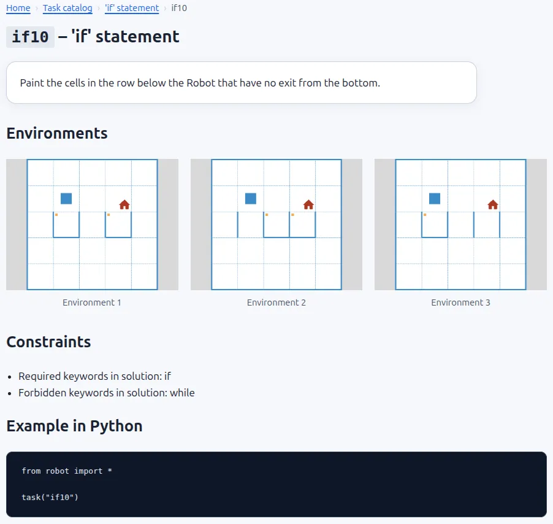
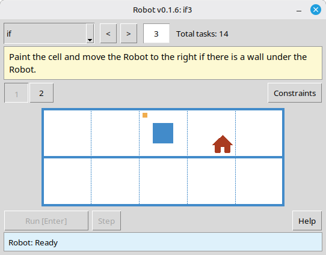

# How to quickly choose Robot tasks for a lesson: the online catalog and the task viewer

Choosing tasks before the lesson starts is much easier than doing it while the class is already waiting. Usually you need more than a task number from a list. You want to see whether the task fits the topic, how many environments it has, whether there are limits, and what idea it is really checking. That matters even more when the task is meant to lead students to a loop, a condition, a helper function, or a solution with a strict command limit.

Robot gives you two tools for that. The first is the online task catalog on the website. The second is the local task viewer that comes with the module itself. They do almost the same job: they let you inspect the material in advance, roughly the way students will see it later.

## What both tools show

Both the online catalog and the local viewer help you judge a task as a whole. In both tools you can see:

- the task text;
- the topic and task number;
- all environments for the task;
- solution limits, when the task has them.

That sounds simple, but it saves real time. When a task has several environments instead of one picture, a quick preview already shows whether it checks mechanical repetition or asks students to write one algorithm that works for every variant.

## The online task catalog

The online catalog is available at [robot.stepindev.com/tasks/index.html](https://robot.stepindev.com/tasks/index.html). It contains the task set from the latest version of the module, grouped by topic. That makes it handy when you want to browse tasks quickly at home, on a school computer, or send a direct link to a colleague without installing Robot first.

The main advantage is simple: the site shows not only the list of topics, but the full task page. You can immediately see the task text, all environments, and any limits. That means you can tell what students will get without launching the local module. It is especially handy before lessons on loops, branching, or functions, where the wrong task can easily turn out too simple or too demanding.

*The online catalog is most useful when you want to inspect the whole task, not just browse topic names.*

## The task viewer in the module

The second tool is part of the module itself and runs locally through `viewer/viewer.py`. In practice that means one useful thing right away: no internet connection is required. If the classroom has weak network access, or none at all, you can still open topics, switch between tasks, and show them on a projector.

For classroom work, another detail may matter even more. The local viewer shows the tasks from the exact version of the module installed on that computer. So if you need to check not the newest set on the website but the set that students actually have, the local viewer is the safer reference point.

*The local viewer is the practical choice when you need the installed version of the module and do not want to depend on the network.*

## Which one to use

The choice is usually straightforward.

- If you want to browse tasks quickly at home or send a link to a colleague, the online catalog is more convenient.
- If you need to work without internet access or confirm the exact installed task set, the local viewer is a better fit.
- If the website version and the local module version differ, use whichever tool matches the real lesson situation.

So this is not really a question of which tool is better in general. It depends on what you need right now: fast browsing, sharing a link, projector work in class, or checking the exact task set students will open.

## A typical lesson prep flow

In practice the workflow is short. You open a topic, look through several tasks in a row, check how many environments each one has, mark a few tasks for the basic level and a few more for stronger students. Then, during the lesson, you can either show the task on a projector or simply give the task number for `task("...")`.

The time savings come from visibility, not from automation. Instead of relying on memory or reopening tasks one by one during the lesson, you can inspect the material in advance from the student's point of view: where the field is obvious, where the environments differ, and where a limit really pushes students toward the intended construct.

That is why both tools are useful in lesson prep. They let you look through the material calmly before class and walk into the lesson already knowing what students are about to see.
