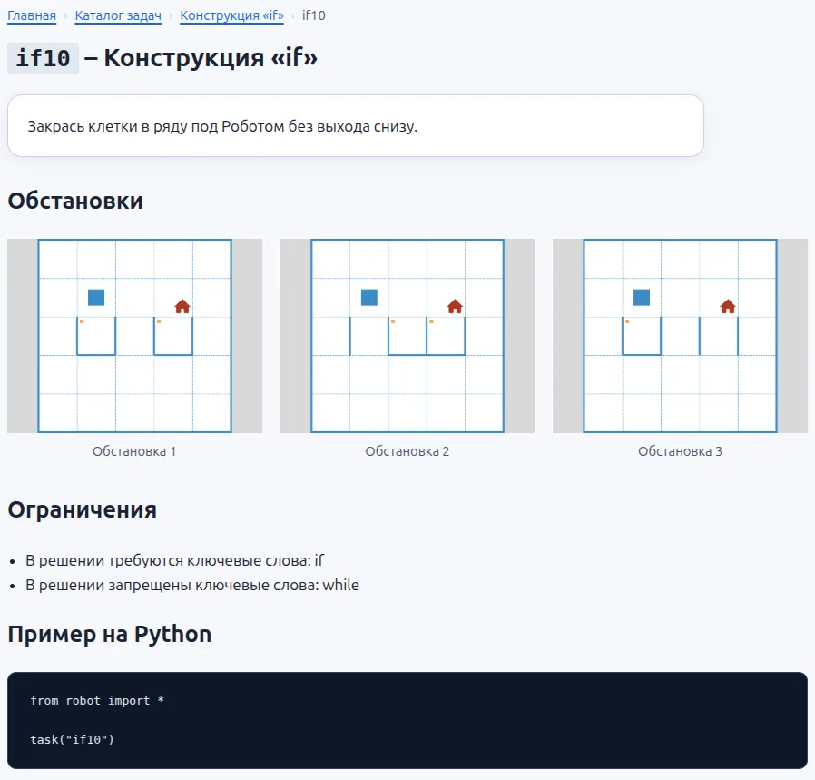
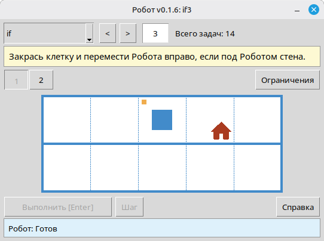

# Как быстро подобрать задачи для урока по исполнителю Роботу: онлайн-каталог и средство просмотра

Подбирать задачи к уроку удобнее заранее, а не в тот момент, когда класс уже ждёт объяснения. Учителю обычно нужно не просто открыть номер из списка, а быстро понять, подходит ли задача под тему, сколько в ней обстановок, есть ли ограничения и на какую идею она нацелена. Особенно это важно там, где задача должна подтолкнуть ученика именно к циклу, условию, своей функции или аккуратному решению с лимитом команд.

Для этого у Робота есть два удобных инструмента. Первый - онлайн-каталог задач на сайте. Второй - локальное средство просмотра, которое входит в модуль. Они нужны почти для одного и того же: помогают заранее увидеть материал так, как его потом увидит ученик.

## Что показывают оба инструмента

И онлайн-каталог, и локальное средство просмотра помогают быстро оценить задачу целиком. В обоих случаях учитель видит:

- текст условия;
- тему и номер задачи;
- все обстановки задачи;
- ограничения на решение, если они есть.

Это простая, но очень практичная вещь. Когда задача состоит не из одной картинки, а из нескольких обстановок, уже по предварительному просмотру видно, проверяет ли она механическое повторение шагов или требует общего алгоритма для всех вариантов.

## Онлайн-каталог задач

Онлайн-каталог открыт на сайте: [robot.stepindev.com/tasks/index_ru.html](https://robot.stepindev.com/tasks/index_ru.html). Он содержит набор задач из последней версии модуля, сгруппированный по темам. Его удобно открывать без установки Робота, когда нужно быстро перебрать несколько заданий дома, на школьном компьютере или просто отправить ссылку коллеге.

Главное достоинство каталога простое: он показывает не только список тем, но и саму страницу задачи. На ней сразу видны условие, все обстановки и ограничения, поэтому учитель может без запуска локального модуля понять, что именно получат ученики. Это особенно полезно перед уроком на циклы, ветвления или функции, когда важно не ошибиться с уровнем сложности.

*В онлайн-каталоге удобно смотреть задачу целиком, а не только список тем.*

## Средство просмотра задач в модуле

Второй инструмент входит в сам модуль и запускается локально через `viewer/viewer.py`. На практике это означает простую вещь: интернет не нужен. Если в кабинете нестабильная сеть или её нет совсем, учитель всё равно может открыть темы, переключать задачи и показывать их на проекторе.

Ещё важнее то, что локальное средство просмотра показывает задачи именно из той версии модуля, которая установлена на этом компьютере. Это удобно, когда нужно свериться не с последней версией на сайте, а с тем набором задач, который реально стоит у учеников или на школьных машинах. Для урока это часто важнее всего.

*Локальное средство просмотра особенно полезно там, где важна именно установленная версия модуля и работа без сети.*

## Чем пользоваться в конкретной ситуации

Выбор обычно зависит от ситуации.

- Если нужно быстро посмотреть задачи дома, прикинуть подборку или отправить ссылку коллеге, удобнее онлайн-каталог.
- Если нужно работать без интернета или проверить именно тот набор задач, который установлен в кабинете, лучше локальное средство просмотра.
- Если версии сайта и локального модуля отличаются, ориентироваться стоит на тот инструмент, который соответствует реальной ситуации на уроке.

Речь тут не о том, какой инструмент лучше вообще. Всё зависит от того, что нужно сейчас: подобрать материал заранее, показать его в классе или проверить, что ученики увидят ровно тот же набор условий и ограничений.

## Как это выглядит при подготовке к уроку

Сценарий подготовки обычно короткий. Учитель открывает нужную тему, смотрит несколько задач подряд, быстро оценивает число обстановок и ограничения, отмечает одну-две задачи для базового уровня и ещё несколько для сильных учеников. После этого на уроке можно или показать условие через проектор, или сразу назвать номер задачи для `task("...")`, чтобы класс открыл её у себя.

В результате время уходит не на поиск по памяти и не на проверку "что же там было в этой задаче", а на содержательный выбор. Учитель заранее видит материал глазами ученика: где поле очевидно, где обстановки разные, где ограничение действительно подталкивает к нужной конструкции, а где задачу лучше оставить на следующий урок.

Каталог и средство просмотра экономят время не потому, что автоматически готовят урок, а потому, что позволяют до начала занятия спокойно увидеть тот материал, с которым потом будет работать класс.
