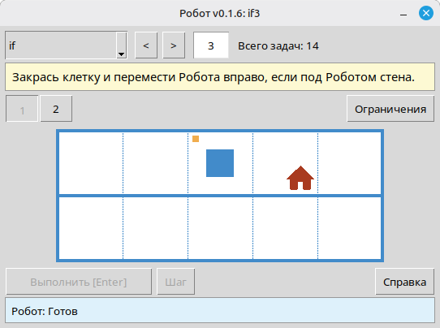

# Как быстро подобрать задачи для урока для исполнителя Робот: онлайн-каталог и средство просмотра

Для просмотра задач есть онлайн-каталог на сайте и локальное средство просмотра в модуле. Оба показывают одно и то же:

- текст условия;
- тему и номер задачи;
- все обстановки;
- ограничения на решение, если они есть.

## Онлайн-каталог задач

Открыт на сайте: [robot.stepindev.com/tasks/index_ru.html](https://robot.stepindev.com/tasks/index_ru.html). Содержит задачи из последней версии модуля, сгруппированные по темам. Удобен, когда нужно быстро перебрать задания дома, на школьном компьютере или отправить ссылку коллеге, ничего не устанавливая.

## Средство просмотра задач в модуле

Запускается локально через `viewer/viewer.py`. Интернет не нужен: в кабинете без сети можно открывать темы, переключать задачи и показывать их на проекторе. И главное: он показывает задачи именно из той версии модуля, которая установлена на этом компьютере, то есть ровно те, что получат ученики.

