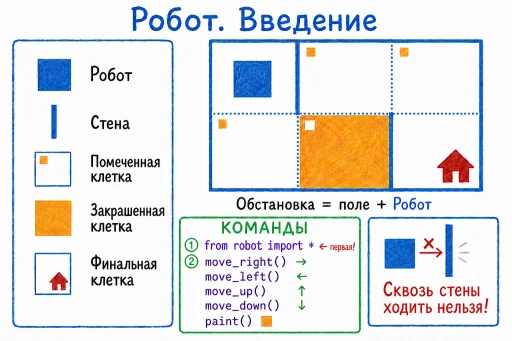
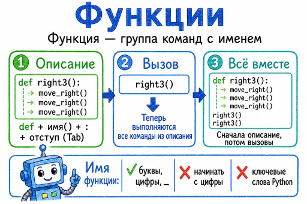
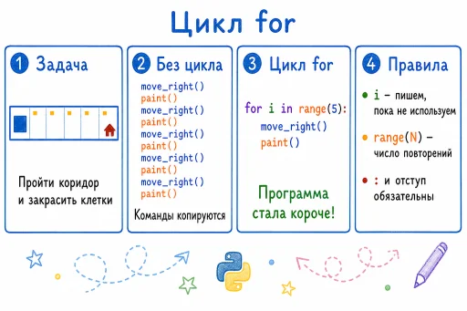
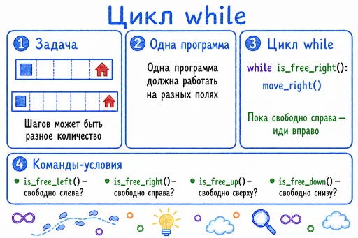
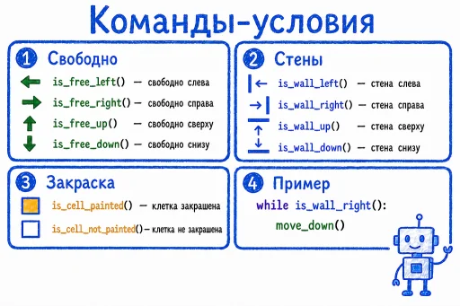
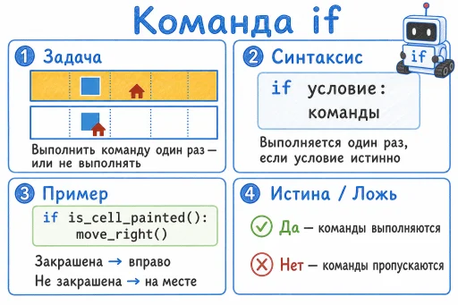
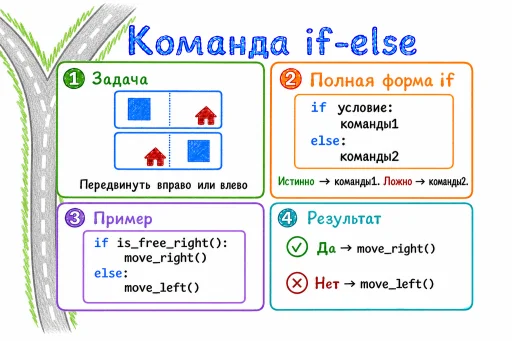
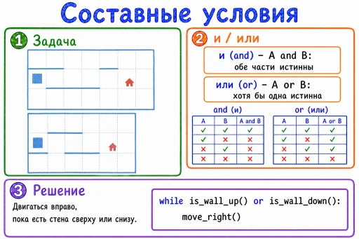

# Плакаты-памятки по исполнителю Робот на Python

К курсу [«Учим Python, управляя Роботом»](https://stepindev.com/ru/courses/ff4ee168-0b12-4376-b6ca-0dcf1d483395) прилагается набор плакатов-памяток. Каждый плакат — это одна тема: поле и базовые команды, цикл, ветвление, функция или составное условие. На плакате помещаются задача, синтаксис, короткий пример и правило, ничего лишнего.

Плакаты рассчитаны на три ситуации. Их можно показать на проекторе в начале урока, распечатать как раздаточный материал на парту или выдать ученику домой для повторения. Они согласованы с задачами курса и с теми же командами, что в справочнике исполнителя. Памятки пригодятся и при работе с модулем Робот в обычном Python: команды на плакатах те же, что в модуле.

> **Коротко.** Восемь плакатов закрывают все темы вводной части курса. Названия на плакатах совпадают с разделами курса, поэтому плакат легко найти под нужный урок.

---

## Темы и порядок

Плакаты идут в том же порядке, в котором темы появляются в курсе. В таблице ниже — какой плакат к какой теме относится и какую идею вводит.

| Плакат | Тема курса | Что вводит |
| --- | --- | --- |
| Робот. Введение | Первые шаги | Поле, Робот, обстановка, `move_*`, `paint`, правило про стены |
| Функции | Функции | «Своя команда»: описание и вызов, правила имени |
| Цикл `for` | Цикл «for» | Известное число повторений, `range`, отступ и двоеточие |
| Цикл `while` | Цикл «while». Часть 1 | Неизвестное число шагов, «одна программа для всех полей» |
| Команды-условия | вспомогательный | `is_free_*`, `is_wall_*`, проверка закраски |
| Команда `if` | Конструкция «if» | Выполнить один раз или не выполнять, истина и ложь |
| Команда `if-else` | «if» и «else» | Ветвление с альтернативой |
| Составные условия | Составные условия | `and` и `or`, таблицы истинности, условие в `while` |

Ниже — коротко по каждому плакату.

### Введение — первые шаги

*Легенда поля, команды движения и закраски, правило «сквозь стены ходить нельзя».*

На плакате собрано всё, что нужно для первой программы: обозначения Робота, стены, помеченной и закрашенной клетки, финальной клетки-домика; обстановка как «поле плюс Робот»; команды `from robot import *`, `move_right`, `move_left`, `move_up`, `move_down` и `paint`. Отдельно отмечено, что сквозь стены ходить нельзя. Плакат удобно показать на самом первом уроке, до того как ученики откроют задачу `intro1`.

### Функции

*Функция как «группа команд с именем»: описание, вызов и правила имени.*

Тема «Функции» идёт в курсе рано, потому что собственные команды помогают организовать даже линейную программу. На плакате — три шага: описание через `def`, вызов по имени и правило «сначала описание, потом вызовы». Ниже — что можно использовать в имени (буквы, цифры, подчёркивание) и чего нельзя: начинать с цифры или брать ключевое слово Python.

### Цикл for

*От копирования команд к `for i in range(N):` и трём правилам синтаксиса.*

Плакат строит переход от механического повторения `move_right()` и `paint()` к циклу `for i in range(5):`. Видно, что программа стала короче, и тут же — правила: переменную `i` пишем, даже если не используем, `range(N)` задаёт число повторений, а двоеточие и отступ обязательны. Хорошо показывать в начале темы «Цикл for», до задач с известным числом шагов.

### Цикл while

*Неизвестное число шагов, универсальная программа и синтаксис `while`.*

Главная идея плаката — число шагов может быть разным, а программа нужна одна для всех полей. Отсюда `while is_free_right(): move_right()` с пояснением «пока свободно справа — иди вправо» и списком команд-условий. Плакат хорошо показывает, зачем вообще нужен цикл с условием, и его стоит выводить на проекторе в начале темы «Цикл while».

### Команды-условия

*Четыре пары «свободно/стена» и две проверки клетки, с примером в `while`.*

Этот плакат вспомогательный: он не привязан к одному номеру темы, а собирает вопросы об обстановке, на которые опираются `while` и `if`. Здесь — `is_free_left`, `is_free_right`, `is_free_up`, `is_free_down` и парные `is_wall_*`, а также `is_cell_painted` и `is_cell_not_painted`. В углу — мини-пример `while is_wall_right(): move_down()`. Удобно держать распечатанным на нескольких уроках подряд, пока класс не освоит команды обратной связи.

### Команда if

*Краткая форма `if`: условие один раз, истина — выполнить, ложь — пропустить.*

Плакат вводит краткую форму ветвления: команду можно выполнить один раз или не выполнять вовсе. На примере `if is_cell_painted(): move_right()` видно, что закрашенная клетка ведёт к шагу, а незакрашенная оставляет Робота на месте. Рядом — короткое объяснение истины и лжи: «да — команды выполняются, нет — пропускаются».

### Команда if-else

*Полная форма `if` с `else`: выбрать одно из двух действий по условию.*

Если краткий `if` выбирает «сделать или пропустить», то `if-else` выбирает одно из двух. На плакате — задача «передвинуть вправо или влево», синтаксис полной формы и пример `if is_free_right(): move_right()` с веткой `else: move_left()`. Ниже — результат: «да — `move_right()`, нет — `move_left()`». Эту тему удобно вводить сразу после краткого `if`.

### Составные условия

*`and` и `or` с таблицами истинности и условием внутри `while`.*

Плакат соединяет всё, что было раньше: условие в `while` и логические операции. Показаны таблицы истинности для `and` («обе части истинны») и `or` («хотя бы одна истинна»), а в решении — `while is_wall_up() or is_wall_down(): move_right()`. Это естественная завершающая тема вводной части: ученик комбинирует команды обратной связи и логические операторы в одном условии.

---

## Как использовать на уроке

### Проектор в начале урока

Открыть плакат по теме, за пару минут разобрать задачу и синтаксис, потом сразу дать задачу из соответствующей темы курса. Этот сценарий хорошо работает для `while`, `for` и `if`: на плакате уже есть связка «задача → решение», и ученику остаётся перенести идею в свою программу.

### Печать как раздаточный материал

Распечатать по одному плакату на парту на уроке введения конструкции. Ученик держит перед собой синтаксис и пример, пока пишет первую программу. «Команды-условия» и «Функции» стоит печатать с запасом: к ним возвращаются на нескольких уроках подряд.

### Домашнее повторение

Выдать комплект плакатов перед контрольной или после темы для самопроверки. Текст на полноразмерных картинках читается чётко при печати на A4, поэтому дома ученик может пользоваться ими как справочником, даже если модуль не установлен.

---

## Полноразмерные изображения

Миниатюры плакатов вставлены в статью выше. Для печати и проектора удобнее полноразмерные картинки: они лежат отдельным набором в репозитории учебных материалов.

Полноразмерные плакаты для печати и проектора: [github.com/step-in-dev/teachingMaterials/tree/main/robot](https://github.com/step-in-dev/teachingMaterials/tree/main/robot).

---

*Плакаты согласованы с курсом [«Учим Python, управляя Роботом»](https://stepindev.com/ru/courses/ff4ee168-0b12-4376-b6ca-0dcf1d483395) и исполнителем [Робот](https://robot.stepindev.com/index_ru.html) на Python.*
