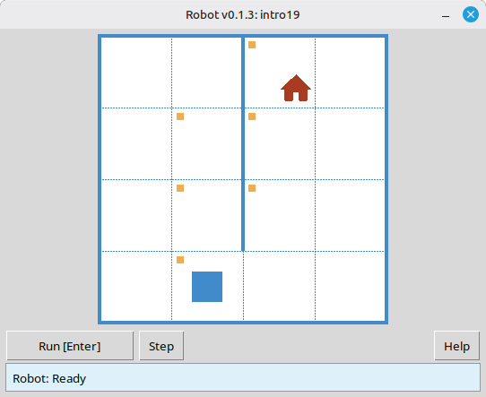

# Robot Simulator: what it is, commands, and how to use it in class

Robot is a classroom simulator that works on a grid. Students write short Python programs to move Robot across cells, paint them, and check walls or cell values. The result shows up right away in the simulator window, and the solution is checked automatically.

This article is for computer science teachers. It explains what the classic school Robot model is, how the Python version works, which commands students can use, what student programs look like, and how Robot fits into a lesson.

> **In short.** Robot is not for robotics kits and not for learning Python for its own sake. It is an environment for practicing algorithmic thinking: the ability to plan exact steps ahead of time and write them so a machine can follow the plan.

---

## Why Robot belongs in the lesson

A school computer science course can cover many things: office tools, language syntax, how a computer is built. In the classic curriculum built around educational simulators, the goal is different. The point is to develop algorithmic thinking and treat it as a skill worth teaching on its own.

That style matters when students have to plan all steps ahead of time instead of deciding on the fly. They need to write the plan without ambiguity, with no "and so on," "roughly," or "if something goes wrong." They also need to describe actions in a formal language that the simulator understands and does not interpret for them.

Robot was created so the hard parts of tasks stay algorithmic, not technical. The classic course strips away extra math and technical detail. Students are left with common sense, a grid field, and a small command set.

The computer and the programming language are tools here, like a pen in math class. A good pen helps you solve more problems. A bad one can eat up the whole lesson. The Robot module is meant to stay out of the way of the algorithm.

---

## What the Robot simulator is

### A teaching model, not a physical robot

In the school curriculum, Robot is described in simple terms. There is a grid field, walls may stand between cells, and Robot sits in one of the cells as a machine with a control panel. The panel has movement buttons for up, down, left, and right.

Teachers often picture Robot as a little remote-controlled machine with an antenna, motors, and suction cups. Since there is no physical classroom Robot, the teacher can play that role at the board: the student dictates commands, and the teacher carries them out.

The key point is simple: Robot carries out commands, it does not write the program. It does not see the whole algorithm and does not know about loops or conditions. It only executes single commands and answers questions about the scene: is there a wall, is the cell painted, what number is in it. The computer reads and runs the program.

### Two ways to control it

In early lessons, it helps to keep comparing two modes of control.

With direct control, a person looks at the field, presses a button, sees the result, and chooses the next button. The plan grows while they work. Even a weaker student can walk around an obstacle on the board if they see Robot.

With program control, a person writes the algorithm first. The computer runs it without the author: it sends commands to the simulator, reads feedback, and decides by the rules in the program.

The move from the first mode to the second is where algorithmic thinking starts to form. Doing it yourself is easy. Writing it so that it works in every environment of the task is harder.

### Where the school Robot came from

The model took shape in the late 1970s and early 1980s. At Moscow State University, the first programming lesson used a simulator called Wanderer, with orientation, a step forward, and turns. For schools, the model was simplified: move right, left, up, and down, with no idea of "which way Robot is facing." When screens appeared, walls were drawn between cells instead of taking up a whole cell.

Similar ideas appeared elsewhere too, for example Karel the Robot in the United States. The idea is the same: a simulator on a grid and tasks that do not depend on advanced math. That makes it a natural first step toward algorithms.

In Russia, Robot became part of school computer science and later entered the Kumir environment. The Python version keeps the same teaching model, but programs are written in Python rather than in the school algorithmic language.

---

## What Robot looks like

On screen, students see a window with the grid. It shows Robot in the current cell, walls between cells and along the border, cells that need painting, cells that are already painted, the task goal, and, when needed, limits such as a command cap or a required loop. At the bottom are Run and Step.



*Robot window: field, walls, task goal, and the result of a run.*

A typical lesson flow:

1. The student creates a `.py` file with `task("intro1")` (or another task from the catalog) and Robot commands.
2. They run the program. The window opens on the first environment.
3. Robot runs the commands. In step mode, each step is visible.
4. If the result does not match the required state, the simulator shows a message and the student fixes the program.
5. Many tasks have several environments, and one program must pass every variant of the field.


*All environments passed. One program worked for every field variant.*

Teachers also get a task viewer. From the unpacked release archive, run `python viewer/viewer.py`. You can open the catalog, pick a topic and number, and show the goal and all environments on a projector without running a student solution.

---

## What Robot can and cannot do

Robot can:

- move one cell in one of four directions;
- paint the current cell;
- tell you whether there is a wall in a given direction and whether the current cell is painted;
- return a number, the "pollution" level in the current cell (the classic course also included radiation or temperature tasks);
- print a number in the current cell (`printn`).

What Robot cannot do, and that is intentional:

- move several cells in one command ("five steps right");
- turn like a Logo turtle;
- choose the next command on its own. The Python program does that;
- "understand" loops, conditions, or functions. Python runs those, while Robot only answers elementary commands.

That is why loops and conditions show up naturally in tasks: they let students repeat a simple step or choose an action based on Robot's answer.

---

## Command system

In the classic course, Robot has a fixed command set: movement, paint, questions about walls and cells, "temperature," and "radiation." Students do not invent new commands on the fly, or the class loses a shared language. In the module, the same groups of ideas appear as functions. The full list is in the [command reference](https://robot.stepindev.com/commands.html).

### Starting a task or a free field


| Command                    | Purpose                                                                                                                                        |
| -------------------------- | ------------------------------------------------------------------------------------------------------------------------------------------------- |
| `task("name")`              | Open a built-in task (for example `task("intro1")`).                                                                               |
| `field(width=8, height=6)` | Open an empty field of the given size without a task file. The start is the top-left corner, the goal is the bottom-right, and success is checked like in a task. |


Most files start with:

```python
from robot import *
```

You can import only the names you need, but in early lessons the short form is easier.

### Movement (4 commands)


| Command        | Action              |
| -------------- | --------------------- |
| `move_right()` | One cell to the right |
| `move_left()`  | One cell to the left  |
| `move_up()`    | One cell up  |
| `move_down()`  | One cell down   |


Commands take no arguments. One call means one step. If the move is impossible because of a wall or the edge of the field, the program stops with an error. That is part of the lesson too.

### Acting on a cell


| Command   | Action                 |
| --------- | ------------------------ |
| `paint()` | Paint the current cell |


### Feedback: walls

For each direction there is a pair of questions, "free?" and "wall?". Two forms make conditions easier to write without relying on negation too early.


| Free path  | Wall             |
| ----------------- | ----------------- |
| `is_free_left()`  | `is_wall_left()`  |
| `is_free_right()` | `is_wall_right()` |
| `is_free_up()`    | `is_wall_up()`    |
| `is_free_down()`  | `is_wall_down()`  |


The functions return `True` or `False`.

### Feedback: paint


| Command                 | Returns `True` when…    |
| ----------------------- | --------------------------- |
| `is_cell_painted()`     | the current cell is painted    |
| `is_cell_not_painted()` | the current cell is not painted |


### Numeric feedback and output


| Command         | Purpose                                         |
| --------------- | -------------------------------------------------- |
| `pol()`         | Pollution level in the current cell (integer) |
| `printn(value)` | Print an integer in the current cell               |


These commands make it possible to set harder tasks, such as finding a minimum on the field and printing results, while staying on the same grid model.

### Why there is no "move right n times" command

Students often ask: if there is `move_right()`, why not `move_right(n)`? Behind that is a larger question. How do you explain that an action that feels natural, like "go five cells right," should be written as a whole algorithm rather than given as one ready-made button?

In the classic methodology, Robot is treated as an external device, separate from the program. That device only performs elementary operations: one step and one question about the scene. Any "smart" command with a parameter makes Robot itself more complicated. It would need more mechanisms and cost more to build. But Robot is controlled by a computer anyway, and the computer can run a loop like "step right n times" without any trouble. There is little reason to make the simulator heavier when the program can already repeat a simple step. The useful split is "simple Robot plus a program with a loop," not "complex Robot plus the same program."

Besides, what counts as a "natural" action depends on the task. Some fields need four-way movement, while others might want knight moves on the grid. If Robot had to be rebuilt for every family of tasks, you would keep redesigning the simulator. The "computer plus Robot with minimal commands" setup works the other way around: for a new class of tasks, you change the algorithm with a loop, a condition, or your own function, not Robot itself. That is why repetition belongs in the program, not in a new button on the panel.

---

## Sample programs

Tasks `intro1`, `intro8`, and `w2` are in the [task catalog](https://robot.stepindev.com/tasks/index.html).

### Example 1. A linear program, first steps

Task: reach the goal from the start cell without loops or conditions.

```python
from robot import *

task("intro1")

move_right()
```


Even this tiny program helps students learn the basic shape of a program.

### Example 2. Painting cells

Task: reach the marked cells and paint them, a typical "First steps" task (`intro8`).

```python
from robot import *

task("intro8")

move_down()
paint()
move_right()
paint()
move_up()
paint()
move_right()
paint()
move_down()
```


Even here, a plain sequence of commands already works as an algorithm.

### Example 3. Feedback and a `while` loop

In task `w2`, Robot stands at the top of a narrow vertical corridor. The goal is on the cell just above the bottom edge of the field. There are two environments with different heights, so the number of steps down is not known in advance. That is why this task leads naturally to the classic "while free below" pattern instead of a long chain of `move_down()`.


Program:

```python
from robot import *

task("w2")

while is_free_down():
    move_down()
```

This is one of the main methodological differences from a turtle. Feedback makes `if` and `while` feel natural before students even reach variables and expressions.

---

## Robot and the turtle: how they differ


|                      | Turtle                    | Robot                                              |
| -------------------- | ---------------------------- | -------------------------------------------------- |
| Movement             | Turn, step with an argument    | Four directions, one step with no arguments        |
| Feedback             | Essentially none                  | Walls, paint, numbers in the cell                    |
| Typical constructs | Sequence, functions  | Sequence, `if`, `while`, functions         |
| How tasks get harder | Often geometry and angles | Through the field and logic                  |


Both models are useful, but they play different roles in a course.

---

## Using Robot in class

### Board work without a computer

1. Draw a field and an obstacle. Place "Robot."
2. Ask a student to give commands: "down," "right," and so on. You execute them.

This is not just a warm-up game. It introduces the split between the computer and the simulator.

### First programs on a computer

1. Download an archive from [GitHub Releases](https://github.com/step-in-dev/robot/releases) and unpack it into a working folder.
2. Start with `sample_solution.py` and task `intro1`.
3. Assign tasks from [First steps](https://robot.stepindev.com/tasks/intro/index.html) (`intro1` through `intro24`) at each student's pace, with automatic checking.

**Requirements:** Python 3.7+ and the standard library. The Robot window needs `tkinter` (usually included with desktop Python).

### Lesson prep for the teacher

- Open the task viewer: pick a topic, read the goal, flip through environments.
- Note limits in the task: operator limit, required function call, rules against extra constructs. They steer students toward the idea you want that day.
- For difficult mistakes, debug step by step in the Robot window on a projector.

### How long to stay on Robot

Early in the course, a lot of time goes to simulators such as Robot, turtle, and similar models. Later, the focus shifts to language features and broader problems. Robot is not the whole course, but it is a solid base for first algorithms. The ideas introduced here, algorithm, loop, branch, function, and the boundary between the program and the simulator, stay with students afterward. It may feel like a "toy" at first. What matters is that the tasks keep growing in algorithmic difficulty instead of repeating the same trick each week.

---

## Frequently asked questions

### How is this Robot different from Kumir?

The field model and teaching approach match the classic school Robot model. The difference is the language: programs are in Python, not the school algorithmic language.

### Do you need the internet?

No. After you download and unpack the archive, the module and tasks run locally.

### Can you teach without computers?

Yes. Algorithmic thinking does not need a computer every lesson. Board work and the "student, computer, Robot" role-play are a full part of the course. Computers speed up checking and let each student work at their own pace.

### What age is it for?

You can explain the field and four directions very early. The methodology even mentions younger grades. Writing algorithms for a computer is usually comfortable from grades 5 through 7.

### Does this replace a Python programming course?

It shifts the focus toward algorithms rather than toward the language for its own sake. The Python syntax here stays small. The goal is to think in algorithms and write them down. The command set is small, and the difficulty lives in the task, not in the commands.

### Where to get tasks and materials?

- [Task catalog on the site](https://robot.stepindev.com/tasks/index.html): goals, field images, topics.
- [Command reference](https://robot.stepindev.com/commands.html).
- [Download the module](https://github.com/step-in-dev/robot/releases) and the [GitHub repository](https://github.com/step-in-dev/robot).

---

*This article follows the classic school-simulator methodology and describes the educational [Robot](https://robot.stepindev.com/index.html) simulator for Python.*
