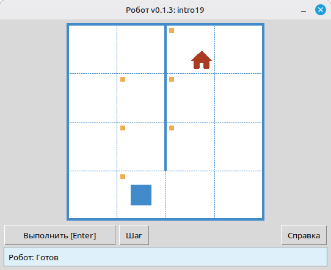

# Исполнитель Робот: что это, команды и как использовать на уроке

Робот — это учебный исполнитель на клетчатом поле. Ученики пишут на Python короткие программы: двигают Робота по клеткам, закрашивают их, проверяют стены и значения в клетках. Что получилось, сразу видно в окне исполнителя, а решение проверяется автоматически.

Статья адресована учителю информатики. В ней разобрано, что такое классический школьный Робот, как он устроен в варианте на Python, какие команды доступны ученику, как выглядят готовые программы и как вписать Робота в урок.

> **Коротко.** Робот нужен не для робототехники и не для того, чтобы выучить Python. Это среда, где тренируют алгоритмическое мышление: умение заранее составить точный план и записать его так, чтобы по нему могла работать машина.

---

## Зачем на уроке нужен именно Робот

У школьного курса информатики бывают разные задачи: научить работать с офисными программами, познакомить с синтаксисом языка программирования, показать устройство компьютера. В классической отечественной методике с учебными исполнителями цель другая. Здесь развивают алгоритмический стиль мышления и рассматривают его как самостоятельную ценность.

Этот стиль нужен там, где человеку приходится продумать все шаги заранее, а не решать по ходу. Нужно записать план без двусмысленностей, без «и так далее», «примерно» и «если что-то пойдёт не так». И нужно описать действия на формальном языке, понятном исполнителю, который ни о чём не догадывается сам.

Робот придумывался для того, чтобы трудности в задачах были алгоритмическими, а не техническими. В классическом курсе убирают лишнюю математику и технические подробности. У ученика остаются здравый смысл, клетчатое поле и небольшой набор команд.

Компьютер и язык программирования здесь, по сути, такие же средства, как ручка в математике. С удобным средством успеваешь решить больше задач. С неудобным урок уходит на «починку ручки». Модуль Робот сделан так, чтобы почти не отвлекать от алгоритма.

---

## Что такое исполнитель Робот

### Учебная модель, а не настоящий робот

В методике школьного курса Робота описывают так: есть клетчатое поле, между клетками могут стоять стены. В одной из клеток находится Робот, условная машинка с пультом управления. На пульте есть кнопки движения вверх, вниз, влево и вправо.

Образно его представляют как радиоуправляемую машинку с антенной, моторами и присосками. Пока «Робота в металле» нет, учитель может сам сыграть исполнителя у доски: ученик диктует команды, учитель их выполняет.

Важно помнить, что Робот — исполнитель, а не программист. Он не видит алгоритм целиком, не знает циклов и условий. Он только выполняет отдельные команды и отвечает на вопросы об обстановке: есть ли стена, закрашена ли клетка, какое в ней число. Программу читает и выполняет компьютер.

### Две схемы управления

На первых занятиях полезно всё время сопоставлять два способа работы с исполнителем.

При непосредственном управлении человек смотрит на поле, нажимает кнопку, видит результат и решает, что нажать дальше. План рождается по ходу. Даже слабый ученик легко обведёт препятствие на доске, если видит Робота.

При программном управлении человек записывает алгоритм заранее, а дальше компьютер выполняет его без автора: отправляет команды исполнителю, получает ответы и принимает решения по правилам, заданным программой.

Переход от первого способа ко второму и есть тренировка алгоритмического мышления. Сделать самому легко, а записать так, чтобы сработало для любой обстановки из задачи, уже трудно.

### Откуда взялся школьный Робот

Модель сложилась на рубеже 1970-х и 1980-х. В МГУ для первого занятия по программированию придумали исполнителя Путник — с ориентацией, шагом вперёд и поворотами. Для школы его упростили: движение вправо, влево, вверх и вниз, без понятия «направление». Когда же появились экраны, стены стали рисовать между клетками, а не занимать ими целую клетку.

Похожие идеи возникали и в других странах — например, Karel the Robot в США. Замысел везде один: исполнитель на клетчатом поле и задачи, не требующие математических знаний. Это естественный первый шаг к алгоритмизации.

Такой Робот стал частью отечественной школьной информатики и вошёл в среду КуМир. Вариант на Python сохраняет ту же учебную модель, только программы пишутся на Python, а не на школьном алгоритмическом языке.

---

## Как выглядит Робот

На экране открывается окно с клетчатым полем. В нём видны Робот в текущей клетке, стены между клетками и по краю поля, отмеченные клетки, которые нужно закрасить, и уже закрашенные. Тут же показано условие задачи и, если они есть, ограничения: лимит команд, требование использовать цикл и так далее. Внизу расположены кнопки Выполнить и Шаг.



*Окно Робота: поле, стены, условие задачи и результат запуска программы.*

На уроке всё обычно идёт так:

1. Ученик создаёт файл `.py` с вызовом `task("intro1")` (или другой задачи из каталога) и командами Робота.
2. Запускает программу — открывается окно с первой обстановкой.
3. Робот выполняет команды; в пошаговом режиме виден каждый шаг.
4. Если результат не совпал с требуемым состоянием, отображается соответствующее сообщение, и ученик правит программу.
5. Во многих задачах несколько обстановок, и одна программа должна пройти все варианты поля.


*Все обстановки задачи пройдены — одна программа сработала для каждого варианта поля.*

Для учителя есть средство просмотра задач. Из распакованного архива с GitHub Releases запустите `python viewer/viewer.py`. Можно открыть каталог, выбрать тему и номер, показать условие и все обстановки на проекторе, причём без запуска ученического решения.

---

## Что умеет Робот (и чего не умеет)

Робот умеет:

- сдвинуться на одну клетку в одном из четырёх направлений;
- закрасить текущую клетку;
- сообщить, есть ли стена в заданном направлении и закрашена ли текущая клетка;
- вернуть число — уровень «загрязнения» в текущей клетке (это аналог задач про радиацию или температуру в классическом курсе);
- вывести число в текущей клетке (команда `printn`).

Чего Робот не умеет, и это методически важно:

- ходить на несколько клеток одной командой («вправо на 5»);
- поворачиваться, как черепашка;
- сам решать, какую команду выполнить следующей: за это отвечает программа на Python;
- «понимать» циклы, условия и функции — их выполняет Python, а Робот лишь откликается на элементарные команды.

Поэтому в задачах и появляются циклы и условия: чтобы повторить простой шаг или выбрать действие по ответу Робота.

---

## Система команд

В классическом курсе набор команд у Робота фиксирован: движение, закраска, вопросы о стенах и клетке, «температура» и «радиация». Допридумывать команды по ходу нельзя — иначе на уроке теряется общая договорённость. В модуле те же смысловые группы выражены функциями. Полный список — в [справочнике команд](https://robot.stepindev.com/commands_ru.html).

### Запуск задачи или свободного поля


| Команда                    | Назначение                                                                                                                                        |
| -------------------------- | ------------------------------------------------------------------------------------------------------------------------------------------------- |
| `task("имя")`              | Открыть задание из встроенного набора (например, `task("intro1")`).                                                                               |
| `field(width=8, height=6)` | Открыть пустое поле заданного размера без файла задачи. Старт — левый верхний угол, цель — правый нижний; успех проверяется так же, как в задаче. |


Обычно в начале файла пишут:

```python
from robot import *
```

Можно импортировать только нужные имена, но на первых занятиях короткая запись удобнее.

### Движение (4 команды)


| Команда        | Действие              |
| -------------- | --------------------- |
| `move_right()` | На одну клетку вправо |
| `move_left()`  | На одну клетку влево  |
| `move_up()`    | На одну клетку вверх  |
| `move_down()`  | На одну клетку вниз   |


Команды вызываются без аргументов: один вызов — один шаг. Если шаг невозможен (стена или край поля), программа завершается с ошибкой. Это тоже часть обучения.

### Действие с клеткой


| Команда   | Действие                 |
| --------- | ------------------------ |
| `paint()` | Закрасить текущую клетку |


### Обратная связь: стены

Для каждого направления есть пара вопросов — «свободно?» и «стена?». С двумя формами проще писать условия, не прибегая к отрицанию слишком рано.


| Свободный проход  | Стена             |
| ----------------- | ----------------- |
| `is_free_left()`  | `is_wall_left()`  |
| `is_free_right()` | `is_wall_right()` |
| `is_free_up()`    | `is_wall_up()`    |
| `is_free_down()`  | `is_wall_down()`  |


Функции возвращают `True` или `False`.

### Обратная связь: закраска


| Команда                 | Возвращает `True`, если…    |
| ----------------------- | --------------------------- |
| `is_cell_painted()`     | текущая клетка закрашена    |
| `is_cell_not_painted()` | текущая клетка не закрашена |


### Числовая обратная связь и вывод


| Команда         | Назначение                                         |
| --------------- | -------------------------------------------------- |
| `pol()`         | Уровень загрязнения в текущей клетке (целое число) |
| `printn(value)` | Вывести целое число в текущей клетке               |


С этими командами появляются задачи посложнее, например поиск минимума на поле и вывод результатов, и всё это на той же модели поля.

### Почему нет команды «вправо на n»

Ученики часто спрашивают: есть `move_right()`, почему нет `move_right(n)`? За этим стоит вопрос поважнее. Как объяснить, что для действия, которое кажется естественным, например «пройти пять клеток вправо», нужно написать целый алгоритм?

В классической методике Робот выступает как внешний исполнитель, существующий отдельно от программы. Такой исполнитель умеет только элементарные операции: один шаг и один вопрос об обстановке. Любая «умная» команда с параметром усложняет самого Робота. Это больше механизмов и больше затрат на устройство. Но Роботом всё равно управляет компьютер, и он без труда выполнит цикл «n раз сделать шаг вправо». Усложнять исполнителя ради того, что программа и так умеет повторить, незачем. Поэтому связка «простой Робот плюс программа с циклом» выгоднее, чем «сложный Робот плюс та же программа».

К тому же «естественное» действие зависит от задачи. На одних полях удобны шаги в четыре стороны, на других нужен ход «конём» по клеткам. Если подстраивать Робота под каждый класс задач, исполнителя пришлось бы постоянно переделывать. Связка «компьютер плюс Робот с простейшими командами» работает наоборот: под новый класс задач настраивается не Робот, а алгоритм, с помощью цикла, условия или своей функции. Поэтому повторение шага записывают в программе, а не добавляют новую кнопку на пульт.

---

## Примеры программ

Задачи `intro1`, `intro8` и `w2` можно открыть в [каталоге задач](https://robot.stepindev.com/tasks/index_ru.html).

### Пример 1. Линейная программа — первые шаги

Задача: дойти из начальной клетки до цели, без условий и циклов.

```python
from robot import *

task("intro1")

move_right()
```


Даже такая короткая программа приучает к форме записи.

### Пример 2. Закрашивание клеток

Задача: дойти до отмеченных клеток и закрасить их — типичная задача из темы «Первые шаги» (`intro8`).

```python
from robot import *

task("intro8")

move_down()
paint()
move_right()
paint()
move_up()
paint()
move_right()
paint()
move_down()
```


Здесь уже видна последовательность команд как алгоритм.

### Пример 3. Обратная связь и цикл «пока свободно»

В задаче `w2` узкий вертикальный коридор. Робот стоит наверху, цель отмечена на клетке прямо над нижней границей поля. Обстановки две, и они разной высоты, поэтому число шагов вниз заранее неизвестно. Отсюда и классическая схема «пока снизу свободно» вместо длинной цепочки `move_down()`.


В программе:

```python
from robot import *

task("w2")

while is_free_down():
    move_down()
```

В этом и состоит главное методическое отличие Робота от черепашки: обратная связь делает естественным появление «если» и «пока» ещё до переменных и выражений.

---

## Робот и «черепашка»: в чём разница


|                      | Черепашка                    | Робот                                              |
| -------------------- | ---------------------------- | -------------------------------------------------- |
| Движение             | Поворот, шаг с аргументом    | Четыре направления, один шаг без аргументов        |
| Обратная связь       | По сути нет                  | Стены, закраска, числа в клетке                    |
| Типичные конструкции | Последовательность, функции  | Последовательность, `if`, `while`, функции         |
| Как усложнять        | Часто через геометрию и углы | Через обстановку на поле и логику                  |


Полезны обе модели, но в курсе у них разные роли.

---

## Как использовать Робота на уроке

### Доска, без компьютера

1. Нарисуйте поле и препятствие. Поставьте «Робота».
2. Попросите ученика командовать: «вниз», «вправо»… Вы выполняете команды.

Это не лишняя игра. Так проще объяснить связку «компьютер и исполнитель».

### Первые программы на компьютере

1. Скачайте архив с [GitHub Releases](https://github.com/step-in-dev/robot/releases) и распакуйте в рабочую папку.
2. Начните с `sample_solution.py` и задачи `intro1`.
3. Дайте серию задач темы [«Первые шаги»](https://robot.stepindev.com/tasks/intro/index_ru.html), от `intro1` до `intro24`, в своём темпе и с автопроверкой.

**Требования:** Python 3.7+ и стандартная библиотека. Для окна Робота нужен `tkinter` (в настольной установке Python он обычно уже есть).

### Подготовка урока учителем

- Откройте средство просмотра задач: выберите тему, прочитайте условие, пролистайте обстановки.
- Посмотрите на ограничения в задаче — лимит операторов, обязательный вызов функции, запрет лишних конструкций. Они подталкивают ученика к той идее, ради которой задуман урок.
- Сложные ошибки разбирайте по шагам в окне Робота на проекторе.

### Сколько времени «гонять Робота»

В начале курса информатики на исполнителей, Робота, Черепаху и их аналоги, уходит много времени. Потом акцент смещается на конструкции языка и более общие задачи. Робот не исчерпывает весь курс, но даёт надёжную опору для первых алгоритмов. Понятия, которые на нём вводятся, алгоритм, цикл, ветвление, функция, граница между программой и исполнителем, остаются с учеником и дальше. Ощущение «игрушки» на первых порах нормально. Важно, чтобы задачи росли по алгоритмической сложности, а не превращались в одно и то же.

---

## Частые вопросы

### Чем этот Робот отличается от КуМира?

Модель поля и методика те же, что у классического школьного Робота. Разница в языке записи: программы пишутся на Python, а не на школьном алгоритмическом языке.

### Нужен ли интернет?

Нет. После скачивания и распаковки архива модуль и задачи работают локально.

### Можно ли проводить урок без компьютера?

Да. Алгоритмическое мышление не требует компьютера на каждом занятии. Доска и ролевая игра «ученик, компьютер, Робот» тоже полноценная часть курса. Компьютер ускоряет проверку и даёт каждому ученику свой темп.

### С какого возраста подходит?

Поле и четыре направления можно объяснить очень рано — в методике упоминают и младших школьников. Записывать алгоритмы для компьютера обычно удобно с 5–7 класса.

### Это замена урокам программирования на Python?

Скорее это смена фокуса: на алгоритмы, а не на язык ради языка. Синтаксиса Python здесь минимум. Цель в другом: научить думать и записывать алгоритмы. Набор команд небольшой, а сложность не в командах, а в самой задаче.

### Где взять задачи и материалы?

- [Каталог задач на сайте](https://robot.stepindev.com/tasks/index_ru.html) — условия, картинки полей, темы.
- [Справочник команд](https://robot.stepindev.com/commands_ru.html).
- [Скачать модуль](https://github.com/step-in-dev/robot/releases) и [репозиторий на GitHub](https://github.com/step-in-dev/robot).

---

*Статья опирается на классическую отечественную методику школьных исполнителей и описывает учебного исполнителя [Робот](https://robot.stepindev.com/index_ru.html) на Python.*
