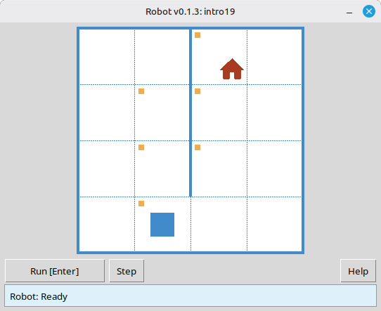
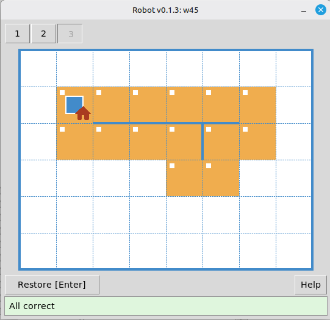
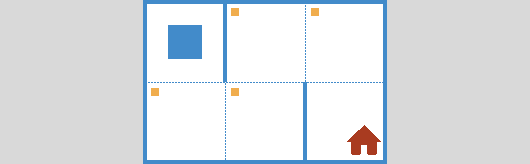
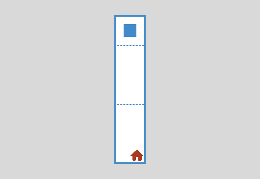

# Robot: what it is, commands, and how to use in class

**Robot** is an educational simulator on a grid field. Students write short **Python** programs: they move Robot, paint cells, and check walls and cell values. The result shows up right away in the simulator window, and the solution is checked automatically.

This article is for computer science teachers. It covers **what the classic school Robot is**, **how it looks in the Python-based version**, **which commands students can use**, **sample programs**, and **how to fit Robot into a lesson**.

> **In short:** Robot is not robotics kits and not "Python for its own sake." It is a place to practice **algorithmic thinking**: planning exact steps and writing them so a **computer** runs the program, not a person improvising along the way.

---

## Why Robot belongs in the lesson

A school informatics course can aim at many things: office tools, language syntax, how a computer is built. In the classic curriculum built around **educational executors**, the main goal is different – **algorithmic thinking** as a skill worth teaching on its own.

That style shows up when a person has to:

1. **Plan all steps ahead of time**, not decide on the fly.
2. Write the plan **without ambiguity** – no "and so on," "roughly," or "if something goes wrong."
3. Describe actions in a **formal language** the executor understands, without guessing the author's intent.

Robot was designed so the hard part stays **algorithmic**, not technical. The classic course strips away extra math, the file system, compilation, and similar noise. Students keep common sense, a clear field, and a small command set. In Python they use short language constructs (`while`, `if`), but **Robot's own commands** stay few, and all of them are about the grid.

**The computer and the programming language are tools**, like a pen in math class. A good pen lets you solve more problems; a bad one eats the lesson fixing the pen. The **Robot** module is meant to stay out of the way: download a release archive, unpack it, call `task("…")`, run the program, and work on the task.

---

## What Robot is

### A teaching model, not a physical robot

In the school curriculum, Robot is described like this:

- there is a **grid field**;
- **walls** may stand between cells;
- **Robot** sits in one cell – a machine with a control panel;
- the panel has movement buttons: up, down, left, right.

Teachers often picture Robot as a radio-controlled car with an antenna, motors, and suction cups. Before anyone builds a metal Robot, the teacher can **play the executor** on the board: the student dictates commands, the teacher carries them out.

What matters: Robot is an **executor**, not the programmer. It does **not** understand the whole algorithm and does **not** know about loops or conditions. It only runs single commands and answers questions about the scene (wall, paint, number in the cell). The **computer runs the program**: the Python interpreter reads the student's code and, one by one, "presses buttons" on the panel.

### Two ways to control it

On early lessons it helps to contrast two modes all the time.

**Direct control.** A person looks at the field, presses a button, sees the result, and chooses the next button. The plan grows while they work. Even a weaker student can walk around an obstacle on the board if they see Robot.

**Program control.** A person **writes the algorithm first**. The computer runs it without the author: it sends commands to the executor, reads feedback, and decides by the rules in the program.

The move from the first mode to the second **is** the training in algorithmic thinking. Doing it yourself is easy; **writing** it so it works for every **environment** in the task is harder.

### Where the school Robot came from

The model took shape in the late 1970s and early 1980s. At Moscow State University the first programming lesson used an executor called **Wanderer** (orientation, step forward, turns). For schools the model was simplified: move **right, left, up, down** without a "which way Robot faces" idea. A. Kh. Shen proposed that scheme; when screens appeared, walls were drawn **between cells** instead of occupying a whole cell.

Similar ideas appeared elsewhere – for example **Karel the Robot** in the United States. The point is the same: a **grid executor without extra math** is a natural first step toward algorithms.

That Robot became part of Russian school informatics and entered the **Kumir** environment. The **Python** version keeps the **same teaching model**, but programs are written in **Python**, not in the school algorithmic language.

---

## What Robot looks like on screen

On screen you see a window with the grid. It shows:

- **Robot** in the current cell;
- **walls** between cells and along the border;
- **marked** cells to paint and cells already **painted**, depending on the task;
- the **task goal** and, when needed, **limits** (command cap, required loop, and so on);
- **Run [Enter]**, **Step**, and a control to pick the **environment**.



*Robot window: field, walls, task goal, and the result of a run.*

A typical lesson flow:

1. The student writes a `.py` file with `task("intro1")` (or another task from the catalog) and Robot commands.
2. They run the program – the window opens on the first **environment**.
3. Robot runs the commands; in step mode each step is visible.
4. If the result does not match the goal, the simulator reports an error; the student fixes the program.
5. Many tasks have several **environments** – one program must pass every variant of the field.



*All environments passed – one program worked for every field variant.*

For teachers there is a **task viewer mode**: from the unpacked release archive run `python viewer/viewer.py`. Open the catalog, pick a topic and number, and show the goal and all environments on a projector without running a student solution.

---

## What Robot can and cannot do

### It can

- move **one cell** in one of four directions;
- **paint** the current cell;
- **report** whether there is a wall in a given direction, and whether the current cell is painted;
- **return a number** – the "pollution" level in the current cell (the classic course also used radiation or temperature tasks);
- **print a number** in the current cell (`printn`).

### It cannot (and that is intentional)

- move **several cells** in one command ("five steps right");
- **turn** like a Logo turtle;
- **choose** the next command on its own – the **Python** program does that;
- "understand" loops, conditions, or functions – **Python** runs those; Robot only answers elementary commands.

That is why loops and conditions show up naturally in tasks: to repeat a simple step or pick an action from Robot's answer.

---

## Command system

In the classic course Robot has a **fixed command set**: movement, paint, questions about walls and cells, "temperature" and "radiation" – students do not invent new ones on the fly, or the class loses a shared language. In the module the same **groups of ideas** appear as functions. The full list is in the [command reference](https://robot.stepindev.com/commands.html).

### Starting a task or a free field

| Command | Purpose |
| -------------------------- | ------------------------------------------------------------------------------------------------------------------------------------------------- |
| `task("name")` | Open a built-in task (for example `task("intro1")`). |
| `field(width=8, height=6)` | Open an empty field of the given size without a task file. Start is the top-left corner, goal is the bottom-right; success is checked like in a task. |

Usually the file starts with:

```python
from robot import *
```

You can import only the names you need, but on early lessons the short form is easier.

### Movement (4 commands)

| Command | Action |
| -------------- | --------------------- |
| `move_right()` | One cell to the right |
| `move_left()` | One cell to the left |
| `move_up()` | One cell up |
| `move_down()` | One cell down |

Commands take **no arguments**: one call, one step. If the step is impossible (wall or field edge), the program stops with an error – that is part of the lesson too.

### Acting on a cell

| Command | Action |
| --------- | ------------------------ |
| `paint()` | Paint the current cell |

### Feedback: walls

For each direction there is a **pair** of questions "free?" / "wall?". That makes conditions easier before students lean on negation.


| Free path | Wall |
| ----------------- | ----------------- |
| `is_free_left()` | `is_wall_left()` |
| `is_free_right()` | `is_wall_right()` |
| `is_free_up()` | `is_wall_up()` |
| `is_free_down()` | `is_wall_down()` |


The functions return `True` or `False`.

### Feedback: paint

| Command | Returns `True` when… |
| ----------------------- | --------------------------- |
| `is_cell_painted()` | the current cell is painted |
| `is_cell_not_painted()` | the current cell is not painted |

### Numeric feedback and output

| Command | Purpose |
| --------------- | -------------------------------------------------- |
| `pol()` | Pollution level in the current cell (integer) |
| `printn(value)` | Print an integer in the current cell |

These commands support harder tasks – finding a minimum on the field, printing results – without leaving the same grid model.

### Why there is no "move right n times" command

Students often ask: there is `move_right()`, so why not `move_right(n)`? Behind that is a bigger question – **how to explain** that an action that feels natural ("go five cells right") needs an **algorithm**, not one ready-made button.

In the classic methodology Robot is an **external** executor: it exists "in hardware" apart from the program. Such an executor only does **elementary** operations – one step, one question about the scene. Any "smart" command with a parameter makes Robot itself more complex. On the lesson, though, a **computer** still controls Robot, and it can run a loop "`n` times – step right" without trouble. There is little point making the executor heavier when the program can repeat a simple command. The useful split is "simple Robot + program with a loop," not "complex Robot + the same program."

Besides, what feels "natural" depends on the **task**. Some fields want four-way steps; others might want knight moves on the grid. If Robot were rebuilt for every task family, you would keep **changing the executor**. The whole "computer + Robot with minimal commands" idea is the opposite: you tune for a class of tasks in the **algorithm** – loop, condition, your own function. That is why repetition belongs in the program, not in a new button on the panel.

---

## Sample programs

Task names (`intro1`, `intro8`, `w2`) are listed in the [task catalog](https://robot.stepindev.com/tasks/index.html).

### Example 1. A linear program – first steps

Task: reach the goal from the start cell without conditions or loops.

```python
from robot import *

task("intro1")

move_right()
```


Even this short program helps students learn the **shape of a program** – hand work to the computer, not "pressing buttons" in their head. Solve on the board by hand first, then write the same steps in a file.

### Example 2. Painting cells

Task: reach marked cells and paint them (typical "First steps" line, task `intro8`).

```python
from robot import *

task("intro8")

move_down()
paint()
move_right()
paint()
move_up()
paint()
move_right()
paint()
move_down()
```



Here a **sequence of commands** is already a full algorithm.

### Example 3. Feedback and a `while` loop

In task `w2` Robot stands at the top of a narrow vertical corridor; the **goal** is on the cell above the bottom edge. Two **environments** differ in height, so the number of steps down is not known in advance – hence the classic "while free below" pattern instead of a long chain of `move_down()`.



**Program:**

```python
from robot import *

task("w2")

while is_free_down():
    move_down()
```

That is the main pedagogical difference from a turtle: **feedback** makes `if` and `while` natural **before** variables and expressions.

---

## Robot and the turtle: how they differ

| | Turtle | Robot |
| -------------------- | ---------------------------- | -------------------------------------------------- |
| Movement | Turn, step with an argument | Four directions, **one step** with no arguments |
| Feedback | Essentially none | Walls, paint, numbers in the cell |
| Typical constructs | Sequence, functions | Sequence, `if`, `while`, functions |
| How tasks get harder | Often geometry and angles | Through **the field** and logic |

Both models are useful, but **they play different roles** in a course.

---

## Using Robot in class

### Board work without a computer

1. Draw a field and an obstacle. Place "Robot."
2. Ask a student to **give commands**: "down," "right"… You execute them.
3. Harder version: "Robot is in the next room" – the student cannot see the field, only asks "free below?" and you answer yes or no.
4. Variant: student faces away from the board, class sees the field – same trick.
5. If someone moves first and checks later – **"Robot crashed."** That fixes the rule: in a program you check the scene **before** the action.

This is not a side game. It introduces the **computer – executor** picture and motivates writing an algorithm.

### First programs on a computer

1. Download an archive from [GitHub Releases](https://github.com/step-in-dev/robot/releases) and unpack it into a working folder.
2. Start with `sample_solution.py` and task `intro1`.
3. Assign tasks from [First steps](https://robot.stepindev.com/tasks/intro/index.html) (`intro1` … `intro24`) at each student's pace, with automatic checking.

**Requirements:** Python 3.7+ and the standard library; the Robot window needs `tkinter` (usually included with desktop Python).

### Loops

1. Give a "go down until the wall" task **before** you explain the `while` loop – many students arrive at "while free – step" on their own.
2. Then show the Python form.
3. Move on to the [`while` loop](https://robot.stepindev.com/tasks/while/index.html) topic.

### Lesson prep for the teacher

- Open **task viewer mode** – pick a topic, read the goal, flip through **environments**.
- Note **limits** in the task: operator cap, required function call, banned constructs – they steer students toward the idea you want that day.
- For hard bugs, debug **step by step** in the Robot window on a projector.

### How long to stay on Robot

Early in informatics, a lot of time goes to **executors** (Robot, turtle, and similar); later the focus shifts to language features and broader problems. Robot is **not the whole course**, but a solid base for first algorithms. The **ideas** (algorithm, loop, branch, function, program vs executor) stay with students afterward. It may feel like a "toy" at first; what matters is that tasks **grow in algorithmic difficulty**, not that every week repeats the same trick.

---

## Frequently asked questions

### How is this Robot different from Kumir?

The **field model and teaching approach** match the classic school Robot. The difference is the **language**: programs are in **Python**, not the school algorithmic language.

### Do you need the internet?

No. After you download and unpack the archive, the module and tasks run **locally**.

### Can you teach without computers?

Yes. Algorithmic thinking does not need a machine every lesson: the board and role-play "student – computer – Robot" are a full part of the course. Computers speed up checking and let each student work at their own pace.

### What age is it for?

You can explain the field and four directions **very early** (the methodology mentions even younger grades). Writing algorithms for a computer is usually comfortable from **grades 5–7**, depending on the school program.

### Does this replace a Python programming course?

It is closer to a **focus on algorithms** than on language for its own sake. Python syntax here stays small; the goal is to **think and write algorithms**. The command reference is short; difficulty lives in the task, not the API.

### Where to get tasks and materials?

- [Task catalog on the site](https://robot.stepindev.com/tasks/index.html) – goals, field images, topics.
- [Command reference](https://robot.stepindev.com/commands.html).
- [Download the module](https://github.com/step-in-dev/robot/releases) and the [GitHub repository](https://github.com/step-in-dev/robot).

---

## Getting started

1. Download an archive from the [releases page](https://github.com/step-in-dev/robot/releases).
2. Unpack into a working folder. Next to the `robot` package, place your solution file (you can start from `sample_solution.py`).
3. Call `task("intro1")`, run the program, and look at the result.
4. Pick a topic in the catalog and choose tasks for your lesson.

---

*This article follows the classic school-executor methodology and describes the open educational [Robot](https://robot.stepindev.com/index.html) simulator for Python.*
