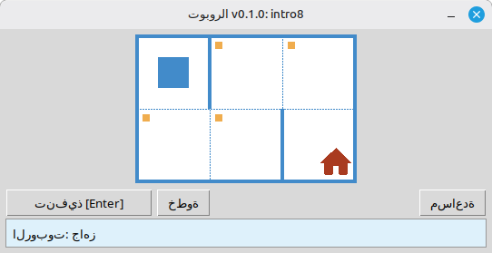

[English](../README.md) | [Русский](./readme_ru.md) | [Беларуская](./readme_be.md) | [Українська](./readme_uk.md) | [Polski](./readme_pl.md) | [Deutsch](./readme_de.md) | [Español](./readme_es.md) | [Français](./readme_fr.md) | [Italiano](./readme_it.md) | [Português](./readme_pt.md) | [简体中文](./readme_zh-hans.md) | [繁體中文](./readme_zh-hant.md) | [日本語](./readme_ja.md) | [한국어](./readme_ko.md) | [العربية](./readme_ar.md) | [اردو](./readme_ur.md) | [हिन्दी](./readme_hi.md) | [বাংলা](./readme_bn.md) | [Čeština](./readme_cs.md) | [Türkçe](./readme_tr.md)

# الروبوت

هذا المشروع هو مُنفِّذ تعليمي لـ **الروبوت** لتعلّم أساسيات البرمجة والخوارزميات. يكتب الطلاب برامج قصيرة بلغة ⁦Python⁩ تحرّك الروبوت على شبكة من الخلايا، وتلوّن الخلايا، وتقرأ البيئة، وتنجز مهامًا صغيرة مع تغذية راجعة بصرية فورية في نافذة سطح المكتب.

مُوجَّه لـ **طلاب المدارس** وكل من يبدأ تعلّم البرمجة: تسلسل الأوامر، الحلقات، الشروط، وحل المسائل البسيطة في بيئة ودودة تُشبه اللعبة.

## مثال: المهمة ⁦intro8⁩



**المهمة:** انقل الروبوت إلى الخلية التي فيها المنزل، ملوّنًا كل خلية مُعلَّمة على طول الطريق.

مثال على الحل بلغة ⁦Python⁩:

```python
from robot import *

task("intro8")

move_down()
paint()
move_right()
paint()
move_up()
paint()
move_right()
paint()
move_down()
```

## أوامر الروبوت

**move_right()**  
يحرك الروبوت خلية واحدة إلى اليمين.

**move_left()**  
يحرك الروبوت خلية واحدة إلى اليسار.

**move_up()**  
يحرك الروبوت خلية واحدة إلى الأعلى.

**move_down()**  
يحرك الروبوت خلية واحدة إلى الأسفل.

**paint()**  
يلون الخلية الحالية.

**is_free_left()**  
يعيد ⁦True⁩ إذا لم يكن هناك جدار على اليسار.

**is_free_right()**  
يعيد ⁦True⁩ إذا لم يكن هناك جدار على اليمين.

**is_free_up()**  
يعيد ⁦True⁩ إذا لم يكن هناك جدار في الأعلى.

**is_free_down()**  
يعيد ⁦True⁩ إذا لم يكن هناك جدار في الأسفل.

**is_wall_left()**  
يعيد ⁦True⁩ إذا كان هناك جدار على اليسار.

**is_wall_right()**  
يعيد ⁦True⁩ إذا كان هناك جدار على اليمين.

**is_wall_up()**  
يعيد ⁦True⁩ إذا كان هناك جدار في الأعلى.

**is_wall_down()**  
يعيد ⁦True⁩ إذا كان هناك جدار في الأسفل.

**is_cell_painted()**  
يعيد ⁦True⁩ إذا كانت الخلية الحالية ملونة.

**is_cell_not_painted()**  
يعيد ⁦True⁩ إذا كانت الخلية الحالية غير ملونة.

**pol()**  
يعيد مستوى التلوث في الخلية الحالية.

**printn(value)**  
يعرض عدداً صحيحاً في الخلية الحالية.

## المهام المتاحة لـ ⁦task()⁩

**الخطوات الأولى**  
intro1, ..., intro24

**الدوال**  
fun1, ..., fun20

**حلقة «⁦for⁩»**  
for1, ..., for28

**حلقة «⁦for⁩» والدوال**  
forfun1, ..., forfun9

**حلقة «⁦while⁩»**  
w1, ..., w51

**حلقة «⁦while⁩» والدوال**  
wfun1, ..., wfun12

**عبارة «⁦if⁩»**  
if1, ..., if14

**حلقة «⁦while⁩» مع «⁦if⁩»**  
wif1, ..., wif13

**«⁦if⁩» و«⁦else⁩»**  
ifelse1, ..., ifelse12

**الشروط المركبة**  
compound1, ..., compound11

## استخدام الوحدة الموزَّعة

1. نزِّل أرشيف الوحدة من صفحة **[⁦GitHub Releases⁩](https://github.com/step-in-dev/robot/releases)**.
2. فكَّ ضغط الأرشيف في مجلد عمل الطالب.
3. احفظ ملف الحل بجانب حزمة ⁦robot⁩. استخدم ملف **⁦sample_solution.py⁩** من الأرشيف كنقطة بداية.
4. لتشغيل تمرين مختلف، غيِّر النص المُمرَّر إلى **⁦task()⁩** (انظر قسم **المهام المتاحة لـ ⁦task()⁩** أعلاه).

المتطلبات: **⁦Python 3⁩** مع المكتبة القياسية (تستخدم الواجهة ⁦tkinter⁩، المُضمَّنة في معظم تثبيتات ⁦Python⁩ على أنظمة سطح المكتب).
