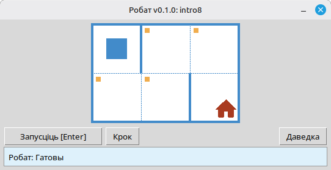

[English](../README.md) | [Русский](./readme_ru.md) | [Беларуская](./readme_be.md) | [Українська](./readme_uk.md) | [Polski](./readme_pl.md) | [Deutsch](./readme_de.md) | [Español](./readme_es.md) | [Français](./readme_fr.md) | [Italiano](./readme_it.md) | [Português](./readme_pt.md) | [简体中文](./readme_zh-hans.md) | [繁體中文](./readme_zh-hant.md) | [日本語](./readme_ja.md) | [한국어](./readme_ko.md) | [العربية](./readme_ar.md) | [اردو](./readme_ur.md) | [हिन्दी](./readme_hi.md) | [বাংলা](./readme_bn.md) | [Čeština](./readme_cs.md)

# Робат

Праект уяўляе сабой вучэбны сімулятар **Робата** для асваення асноў праграмавання і алгарытмізацыі. Навучэнцы пішуць кароткія праграмы на Python, якія кіруюць Робатам на клеткавым полі: перамяшчаюць яго, фарбуюць клеткі, счытваюць стан асяроддзя і вырашаюць невялікія заданні з нагляднай зваротнай сувяззю ў акне праграмы.

Прызначаны для **школьнікаў** і ўсіх, хто пачынае вывучаць праграмаванне: паслядоўнасці дзеянняў, цыклы, умовы і рашэнне простых задач у прыязным гульнявым асяроддзі.

## Прыклад: заданне `intro8`



**Заданне:** Перамясціце Робата на клетку з домам, фарбуючы па шляху ўсе пазначаныя клеткі.

Прыклад рашэння на Python:

```python
from robot import *

task("intro8")

move_down()
paint()
move_right()
paint()
move_up()
paint()
move_right()
paint()
move_down()
```

## Каманды Робата

**move_right()**  
Зсувае Робата на адну клетку ўправа.

**move_left()**  
Зсувае Робата на адну клетку ўлева.

**move_up()**  
Зсувае Робата на адну клетку ўверх.

**move_down()**  
Зсувае Робата на адну клетку ўніз.

**paint()**  
Фарбуе бягучую клетку.

**is_free_left()**  
Вяртае True, калі злева няма сцяны.

**is_free_right()**  
Вяртае True, калі справа няма сцяны.

**is_free_up()**  
Вяртае True, калі зверху няма сцяны.

**is_free_down()**  
Вяртае True, калі знізу няма сцяны.

**is_wall_left()**  
Вяртае True, калі злева сцяна.

**is_wall_right()**  
Вяртае True, калі справа сцяна.

**is_wall_up()**  
Вяртае True, калі зверху сцяна.

**is_wall_down()**  
Вяртае True, калі знізу сцяна.

**is_cell_painted()**  
Вяртае True, калі бягучая клетка пафарбаваная.

**is_cell_not_painted()**  
Вяртае True, калі бягучая клетка не пафарбаваная.

**pol()**  
Вяртае ўзровень забруджвання бягучай клеткі.

**printn(value)**  
Выводзіць цэлы лік у бягучай клетцы.

## Даступныя заданні для `task()`

**Першыя крокі**  
intro1, ..., intro24

**Функцыі**  
fun1, ..., fun20

**Цыкл «for»**  
for1, ..., for28

**Цыкл «for» і функцыі**  
forfun1, ..., forfun9

**Цыкл «while»**  
w1, ..., w51

**Цыкл «while» і функцыі**  
wfun1, ..., wfun12

**Канструкцыя «if»**  
if1, ..., if14

**Цыкл «while» з канструкцыяй «if»**  
wif1, ..., wif13

**«if» і «else»**  
ifelse1, ..., ifelse12

**Складаныя ўмовы**  
compound1, ..., compound11

## Выкарыстанне распаўсюджванага модуля

1. Спампуйце архіў модуля са старонкі **[GitHub Releases](https://github.com/step-in-dev/robot/releases)**.
2. Распакуйце архіў у працоўную папку навучэнца.
3. Захавайце файл з рашэннем побач з пакетам `robot`. У якасці адпраўной кропкі выкарыстоўвайце файл **`sample_solution.py`** з архіва.
4. Каб запусціць іншае практыкаванне, змяніце радок, які перадаецца ў **`task()`** (гл. раздзел **Даступныя заданні для `task()`** вышэй).

Патрабаванні: **Python 3** са стандартнай бібліятэкай (інтэрфейс выкарыстоўвае `tkinter`, які ўваходзіць у большасць усталёвак Python на настольных сістэмах).
