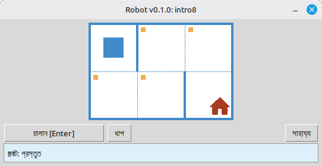

# রোবট

এই প্রকল্পটি প্রোগ্রামিং ও অ্যালগরিদমের মূল বিষয় শেখার জন্য একটি শিক্ষামূলক **রোবট** সিমুলেটর। শিক্ষার্থীরা ছোট Python প্রোগ্রাম লেখে যা রোবটকে গ্রিডের উপর নিয়ে চলে, ঘর রাঙায়, পরিবেশ পড়ে এবং ডেস্কটপ উইন্ডোতে তাৎক্ষণিক চাক্ষুষ প্রতিক্রিয়াসহ ছোট কাজ সম্পন্ন করে।

এটি **স্কুল শিক্ষার্থী** ও প্রোগ্রামিং শিখতে শুরু করা সবার জন্য: ধারাবাহিকতা, লুপ, শর্ত এবং সহজ সমস্যা সমাধান একটি বন্ধুত্বপূর্ণ, খেলাধুলার মতো পরিবেশে।

## উদাহরণ: কাজ `intro8`



**কাজ:** রোবটকে বাড়িওয়ালা ঘরে নিয়ে যান, পথে সব চিহ্নিত ঘর রাঙিয়ে।

Python-এ সমাধানের উদাহরণ:

```python
from robot import *

task("intro8")

move_down()
paint()
move_right()
paint()
move_up()
paint()
move_right()
paint()
move_down()
```

## রোবটের নির্দেশ

**move_right()**  
রোবটকে এক ঘর ডানে সরায়।

**move_left()**  
রোবটকে এক ঘর বামে সরায়।

**move_up()**  
রোবটকে এক ঘর উপরে সরায়।

**move_down()**  
রোবটকে এক ঘর নিচে সরায়।

**paint()**  
বর্তমান ঘর রাঙায়।

**is_free_left()**  
বামে দেয়াল না থাকলে True দেয়।

**is_free_right()**  
ডানে দেয়াল না থাকলে True দেয়।

**is_free_up()**  
উপরে দেয়াল না থাকলে True দেয়।

**is_free_down()**  
নিচে দেয়াল না থাকলে True দেয়।

**is_wall_left()**  
বামে দেয়াল থাকলে True দেয়।

**is_wall_right()**  
ডানে দেয়াল থাকলে True দেয়।

**is_wall_up()**  
উপরে দেয়াল থাকলে True দেয়।

**is_wall_down()**  
নিচে দেয়াল থাকলে True দেয়।

**is_cell_painted()**  
বর্তমান ঘর রাঙানো থাকলে True দেয়।

**is_cell_not_painted()**  
বর্তমান ঘর রাঙানো না থাকলে True দেয়।

**pol()**  
বর্তমান ঘরের দূষণ মান দেয়।

**printn(value)**  
বর্তমান ঘরে একটি পূর্ণসংখ্যা দেখায়।

## `task()`-এর জন্য উপলব্ধ কাজ

**প্রথম পদক্ষেপ**  
intro1, ..., intro24

**ফাংশন**  
fun1, ..., fun20

**'for' লুপ**  
for1, ..., for28

**'for' লুপ এবং ফাংশন**  
forfun1, ..., forfun9

**'while' লুপ**  
w1, ..., w51

**'while' লুপ এবং ফাংশন**  
wfun1, ..., wfun12

**'if' বিবৃতি**  
if1, ..., if14

**'while' লুপ এবং 'if'**  
wif1, ..., wif13

**'if' এবং 'else'**  
ifelse1, ..., ifelse12

**যৌক্ত শর্তাবলী**  
compound1, ..., compound11

## বিতরণকৃত মডিউল ব্যবহার

1. **[GitHub Releases](https://github.com/step-in-dev/robot/releases)** পৃষ্ঠা থেকে মডিউল আর্কাইভ ডাউনলোড করুন।
2. আর্কাইভটি শিক্ষার্থীর কাজের ফোল্ডারে এক্সট্রাক্ট করুন।
3. আপনার সমাধান ফাইল `robot` প্যাকেজের পাশে সংরক্ষণ করুন। শুরু করার জন্য আর্কাইভ থেকে **`sample_solution.py`** ব্যবহার করুন।
4. ভিন্ন অনুশীলন চালাতে, **`task()`**-এ দেওয়া স্ট্রিং পরিবর্তন করুন (উপরে **`task()`-এর জন্য উপলব্ধ কাজ** অংশ দেখুন)।

প্রয়োজনীয়তা: স্ট্যান্ডার্ড লাইব্রেরিসহ **Python 3** (UI `tkinter` ব্যবহার করে, যা ডেস্কটপ সিস্টেমের বেশিরভাগ Python ইনস্টলেশনে অন্তর্ভুক্ত থাকে)।
