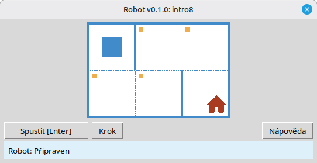

# Robot

Tento projekt je vzdělávací simulátor **Robota** pro výuku základů programování a algoritmů. Studenti píší krátké programy v Pythonu, které pohybují Robotem na mřížce, vybarvují buňky, čtou prostředí a řeší malé úlohy s okamžitou vizuální zpětnou vazbou v okně aplikace.

Je určen pro **studenty** a všechny, kdo začínají s programováním: posloupnosti, cykly, podmínky a jednoduché řešení problémů v přívětivém, herním prostředí.

**Web:** [robot.stepindev.com](https://robot.stepindev.com) – katalog úloh, přehled příkazů a články.

## Příklad: úloha `intro8`



**Úloha:** Přesuňte Robota na buňku s domem a cestou vybarvěte všechny označené buňky.

Ukázkové řešení v Pythonu:

```python
from robot import *

task("intro8")

move_down()
paint()
move_right()
paint()
move_up()
paint()
move_right()
paint()
move_down()
```

## Příkazy Robota

**move_right()**  
Posune Robota o jednu buňku doprava.

**move_left()**  
Posune Robota o jednu buňku doleva.

**move_up()**  
Posune Robota o jednu buňku nahoru.

**move_down()**  
Posune Robota o jednu buňku dolů.

**paint()**  
Vybarví aktuální buňku.

**is_free_left()**  
Vrátí True, pokud není vlevo zeď.

**is_free_right()**  
Vrátí True, pokud není vpravo zeď.

**is_free_up()**  
Vrátí True, pokud není nahoře zeď.

**is_free_down()**  
Vrátí True, pokud není dole zeď.

**is_wall_left()**  
Vrátí True, pokud je vlevo zeď.

**is_wall_right()**  
Vrátí True, pokud je vpravo zeď.

**is_wall_up()**  
Vrátí True, pokud je nahoře zeď.

**is_wall_down()**  
Vrátí True, pokud je dole zeď.

**is_cell_painted()**  
Vrátí True, pokud je aktuální buňka vybarvená.

**is_cell_not_painted()**  
Vrátí True, pokud aktuální buňka není vybarvená.

**pol()**  
Vrátí úroveň znečištění aktuální buňky.

**printn(value)**  
Vypíše celé číslo v aktuální buňce.

## Dostupné úlohy pro `task()`

**První kroky**  
intro1, …, intro24

**Funkce**  
fun1, …, fun20

**Cyklus „for“**  
for1, …, for28

**Cyklus „for“ a funkce**  
forfun1, …, forfun9

**Cyklus „while“**  
w1, …, w51

**Cyklus „while“ a funkce**  
wfun1, …, wfun12

**Příkaz „if“**  
if1, …, if14

**Cyklus „while“ s příkazem „if“**  
wif1, …, wif13

**„if“ a „else“**  
ifelse1, …, ifelse12

**Složené podmínky**  
compound1, …, compound11

## Použití distribuovaného modulu

1. Stáhněte si archiv modulu ze stránky **[GitHub Releases](https://github.com/step-in-dev/robot/releases)**.
2. Rozbalte archiv do pracovní složky studenta.
3. Uložte soubor s řešením vedle balíčku `robot`. Jako výchozí bod použijte soubor **`sample_solution.py`** z archivu.
4. Pro spuštění jiného cvičení změňte řetězec předávaný funkci **`task()`** (viz sekce **Dostupné úlohy pro `task()`** výše).

Požadavky: **Python 3.7+** se standardní knihovnou (uživatelské rozhraní používá `tkinter`, který je součástí většiny instalací Pythonu na stolních počítačích).
