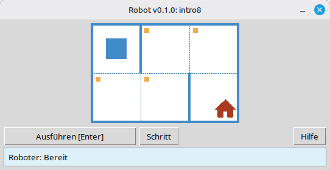

[English](../README.md) | [Русский](./readme_ru.md) | [Беларуская](./readme_be.md) | [Українська](./readme_uk.md) | [Polski](./readme_pl.md) | [Deutsch](./readme_de.md) | [Español](./readme_es.md) | [Français](./readme_fr.md) | [Português](./readme_pt.md) | [简体中文](./readme_zh-hans.md) | [繁體中文](./readme_zh-hant.md) | [日本語](./readme_ja.md) | [한국어](./readme_ko.md) | [العربية](./readme_ar.md) | [اردو](./readme_ur.md)

# Robot

Dieses Projekt ist ein pädagogischer **Roboter**-Simulator zum Erlernen der Grundlagen von Programmierung und Algorithmik. Schüler schreiben kurze Python-Programme, die den Roboter auf einem Gitter bewegen, Zellen färben, die Umgebung auslesen und kleine Aufgaben mit sofortiger visueller Rückmeldung in einem Desktop-Fenster lösen.

Es ist für **Schüler** und alle gedacht, die mit dem Programmieren beginnen: Sequenzen, Schleifen, Bedingungen und einfaches Problemlösen in einer freundlichen, spielähnlichen Umgebung.

## Beispiel: Aufgabe `intro8`



**Aufgabe:** Bewege den Roboter auf die Zelle mit dem Haus und färbe dabei jede markierte Zelle auf dem Weg.

Beispiellösung in Python:

```python
from robot import *

task("intro8")

move_down()
paint()
move_right()
paint()
move_up()
paint()
move_right()
paint()
move_down()
```

## Roboter-Befehle

**move_right()**  
Bewegt den Roboter eine Zelle nach rechts.

**move_left()**  
Bewegt den Roboter eine Zelle nach links.

**move_up()**  
Bewegt den Roboter eine Zelle nach oben.

**move_down()**  
Bewegt den Roboter eine Zelle nach unten.

**paint()**  
Färbt die aktuelle Zelle.

**is_free_left()**  
Gibt True zurück, wenn links keine Wand ist.

**is_free_right()**  
Gibt True zurück, wenn rechts keine Wand ist.

**is_free_up()**  
Gibt True zurück, wenn oben keine Wand ist.

**is_free_down()**  
Gibt True zurück, wenn unten keine Wand ist.

**is_wall_left()**  
Gibt True zurück, wenn links eine Wand ist.

**is_wall_right()**  
Gibt True zurück, wenn rechts eine Wand ist.

**is_wall_up()**  
Gibt True zurück, wenn oben eine Wand ist.

**is_wall_down()**  
Gibt True zurück, wenn unten eine Wand ist.

**is_cell_painted()**  
Gibt True zurück, wenn die aktuelle Zelle gefärbt ist.

**is_cell_not_painted()**  
Gibt True zurück, wenn die aktuelle Zelle nicht gefärbt ist.

**pol()**  
Gibt den Verschmutzungswert der aktuellen Zelle zurück.

**printn(value)**  
Gibt eine Ganzzahl in der aktuellen Zelle aus.

## Verfügbare Aufgaben für `task()`

**Erste Schritte**  
intro1, ..., intro24

**Funktionen**  
fun1, ..., fun20

**'for'-Schleife**  
for1, ..., for28

**'for'-Schleife und Funktionen**  
forfun1, ..., forfun9

**'while'-Schleife**  
w1, ..., w51

**'while'-Schleife und Funktionen**  
wfun1, ..., wfun12

**'if'-Anweisung**  
if1, ..., if14

**'while'-Schleife mit 'if'**  
wif1, ..., wif13

**'if' und 'else'**  
ifelse1, ..., ifelse12

**Zusammengesetzte Bedingungen**  
compound1, ..., compound11

## Verwendung des verteilten Moduls

1. Laden Sie das Modul-Archiv von der Seite **[GitHub Releases](https://github.com/step-in-dev/robot/releases)** herunter.
2. Entpacken Sie das Archiv in den Arbeitsordner des Schülers.
3. Speichern Sie Ihre Lösungsdatei neben dem `robot`-Paket. Verwenden Sie **`sample_solution.py`** aus dem Archiv als Ausgangspunkt.
4. Um eine andere Übung auszuführen, ändern Sie die Zeichenkette, die an **`task()`** übergeben wird (siehe Abschnitt **Verfügbare Aufgaben für `task()`** oben).

Voraussetzungen: **Python 3** mit der Standardbibliothek (die Benutzeroberfläche verwendet `tkinter`, das in den meisten Python-Installationen auf Desktop-Systemen enthalten ist).
