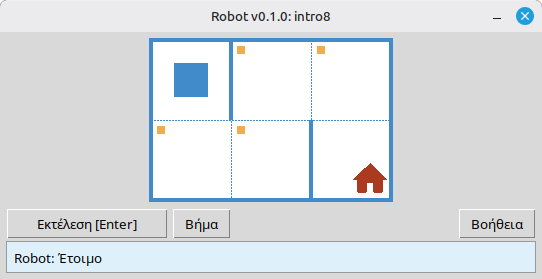

# Robot

Αυτό το έργο είναι ένας εκπαιδευτικός προσομοιωτής Robot για την εκμάθηση βασικού προγραμματισμού και αλγορίθμων. Οι μαθητές γράφουν σύντομα προγράμματα Python που μετακινούν το Robot σε ένα πλέγμα, βάφουν κελιά, διαβάζουν το περιβάλλον και ολοκληρώνουν μικρές εργασίες με άμεση οπτική ανατροφοδότηση σε παράθυρο επιφάνειας εργασίας.

Προορίζεται για μαθητές σχολείου και όσους ξεκινούν να μαθαίνουν προγραμματισμό: ακολουθία εντολών, βρόχους, συνθήκες και απλή επίλυση προβλημάτων σε ένα φιλικό περιβάλλον που μοιάζει με παιχνίδι.

**Ιστότοπος:** [robot.stepindev.com](https://robot.stepindev.com) – κατάλογος ασκήσεων, αναφορά εντολών και άρθρα.

## Παράδειγμα: εργασία `intro8`



**Εργασία:** Μετακινήστε το Robot στο κελί με το σπίτι, βάφοντας κάθε σημασμένο κελί στη διαδρομή.

Ενδεικτική λύση σε Python:

```python
from robot import *

task("intro8")

move_down()
paint()
move_right()
paint()
move_up()
paint()
move_right()
paint()
move_down()
```

## Εντολές Robot

**move_right()**  
Μετακινεί το Robot ένα κελί δεξιά.

**move_left()**  
Μετακινεί το Robot ένα κελί αριστερά.

**move_up()**  
Μετακινεί το Robot ένα κελί πάνω.

**move_down()**  
Μετακινεί το Robot ένα κελί κάτω.

**paint()**  
Βάφει το τρέχον κελί.

**is_free_left()**  
Επιστρέφει True αν δεν υπάρχει τοίχος αριστερά.

**is_free_right()**  
Επιστρέφει True αν δεν υπάρχει τοίχος δεξιά.

**is_free_up()**  
Επιστρέφει True αν δεν υπάρχει τοίχος πάνω.

**is_free_down()**  
Επιστρέφει True αν δεν υπάρχει τοίχος κάτω.

**is_wall_left()**  
Επιστρέφει True αν υπάρχει τοίχος αριστερά.

**is_wall_right()**  
Επιστρέφει True αν υπάρχει τοίχος δεξιά.

**is_wall_up()**  
Επιστρέφει True αν υπάρχει τοίχος πάνω.

**is_wall_down()**  
Επιστρέφει True αν υπάρχει τοίχος κάτω.

**is_cell_painted()**  
Επιστρέφει True αν το τρέχον κελί είναι βαμμένο.

**is_cell_not_painted()**  
Επιστρέφει True αν το τρέχον κελί δεν είναι βαμμένο.

**pol()**  
Επιστρέφει το επίπεδο ρύπανσης του τρέχοντος κελιού.

**printn(value)**  
Εκτυπώνει έναν ακέραιο στο τρέχον κελί.

## Διαθέσιμες εργασίες για `task()`

**Πρώτα βήματα**  
intro1, ..., intro24

**Συναρτήσεις**  
fun1, ..., fun20

**Βρόχος «for»**  
for1, ..., for28

**Βρόχος «for» και συναρτήσεις**  
forfun1, ..., forfun9

**Βρόχος «while»**  
w1, ..., w51

**Βρόχος «while» και συναρτήσεις**  
wfun1, ..., wfun12

**Δήλωση «if»**  
if1, ..., if14

**Βρόχος «while» με «if»**  
wif1, ..., wif15

**«if» και «else»**  
ifelse1, ..., ifelse10

**Σύνθετες συνθήκες**  
compound1, ..., compound11

## Χρήση του διανεμόμενου αρθρώματος

1. Κατεβάστε το αρχείο αρθρώματος από τη σελίδα **[GitHub Releases](https://github.com/step-in-dev/robot/releases)**.
2. Αποσυμπιέστε το αρχείο στον φάκελο εργασίας του μαθητή.
3. Αποθηκεύστε το αρχείο λύσης σας δίπλα στη μονάδα `robot`. Χρησιμοποιήστε το **`sample_solution.py`** από το αρχείο ως σημείο εκκίνησης.
4. Για να εκτελέσετε διαφορετική άσκηση, αλλάξτε τη συμβολοσειρά που περνάτε στην **`task()`** (δείτε την ενότητα **Διαθέσιμες εργασίες για `task()`** παραπάνω).

Απαιτήσεις: **Python 3.7+** με την πρότυπη βιβλιοθήκη (η διεπαφή χρήστη χρησιμοποιεί `tkinter`, το οποίο περιλαμβάνεται στις περισσότερες εγκαταστάσεις Python σε συστήματα επιφάνειας εργασίας).
