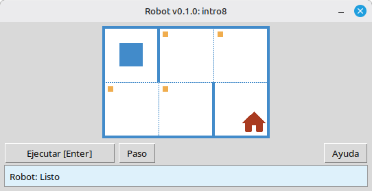

[English](../README.md) | [Русский](./readme_ru.md) | [Беларуская](./readme_be.md) | [Українська](./readme_uk.md) | [Polski](./readme_pl.md) | [Deutsch](./readme_de.md) | [Español](./readme_es.md) | [Français](./readme_fr.md) | [Italiano](./readme_it.md) | [Português](./readme_pt.md) | [简体中文](./readme_zh-hans.md) | [繁體中文](./readme_zh-hant.md) | [日本語](./readme_ja.md) | [한국어](./readme_ko.md) | [العربية](./readme_ar.md) | [اردو](./readme_ur.md) | [हिन्दी](./readme_hi.md) | [বাংলা](./readme_bn.md) | [Čeština](./readme_cs.md) | [Türkçe](./readme_tr.md)

# Robot

Este proyecto es un simulador educativo de **Robot** para aprender los fundamentos de la programación y los algoritmos. Los estudiantes escriben programas cortos en Python que mueven el Robot por una cuadrícula, pintan celdas, leen el entorno y completan pequeñas tareas con retroalimentación visual inmediata en una ventana de escritorio.

Está pensado para **estudiantes de escuela** y cualquier persona que empiece a aprender programación: secuencias, bucles, condiciones y resolución de problemas simples en un entorno amigable, similar a un juego.

## Ejemplo: tarea `intro8`



**Tarea:** Mueve el Robot a la celda con la casa, pintando cada celda marcada en el camino.

Solución de ejemplo en Python:

```python
from robot import *

task("intro8")

move_down()
paint()
move_right()
paint()
move_up()
paint()
move_right()
paint()
move_down()
```

## Comandos del Robot

**move_right()**  
Mueve el Robot una celda a la derecha.

**move_left()**  
Mueve el Robot una celda a la izquierda.

**move_up()**  
Mueve el Robot una celda hacia arriba.

**move_down()**  
Mueve el Robot una celda hacia abajo.

**paint()**  
Pinta la celda actual.

**is_free_left()**  
Devuelve True si no hay pared a la izquierda.

**is_free_right()**  
Devuelve True si no hay pared a la derecha.

**is_free_up()**  
Devuelve True si no hay pared arriba.

**is_free_down()**  
Devuelve True si no hay pared abajo.

**is_wall_left()**  
Devuelve True si hay pared a la izquierda.

**is_wall_right()**  
Devuelve True si hay pared a la derecha.

**is_wall_up()**  
Devuelve True si hay pared arriba.

**is_wall_down()**  
Devuelve True si hay pared abajo.

**is_cell_painted()**  
Devuelve True si la celda actual está pintada.

**is_cell_not_painted()**  
Devuelve True si la celda actual no está pintada.

**pol()**  
Devuelve el valor de contaminación de la celda actual.

**printn(value)**  
Muestra un entero en la celda actual.

## Tareas disponibles para `task()`

**Primeros pasos**  
intro1, …, intro24

**Funciones**  
fun1, …, fun20

**Bucle 'for'**  
for1, …, for28

**Bucle 'for' y funciones**  
forfun1, …, forfun9

**Bucle 'while'**  
w1, …, w51

**Bucle 'while' y funciones**  
wfun1, …, wfun12

**Sentencia 'if'**  
if1, …, if14

**Bucle 'while' con 'if'**  
wif1, …, wif13

**'if' y 'else'**  
ifelse1, …, ifelse12

**Condiciones compuestas**  
compound1, …, compound11

## Cómo usar el módulo distribuido

1. Descargue el archivo del módulo desde la página **[GitHub Releases](https://github.com/step-in-dev/robot/releases)**.
2. Extraiga el archivo en la carpeta de trabajo del estudiante.
3. Guarde su archivo de solución junto al paquete `robot`. Use **`sample_solution.py`** del archivo como punto de partida.
4. Para ejecutar un ejercicio diferente, cambie la cadena pasada a **`task()`** (consulte la sección **Tareas disponibles para `task()`** arriba).

Requisitos: **Python 3** con la biblioteca estándar (la interfaz usa `tkinter`, que se incluye en la mayoría de las instalaciones de Python en sistemas de escritorio).
