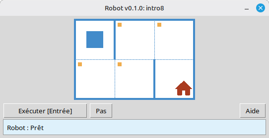

[English](../README.md) | [Русский](./readme_ru.md) | [Беларуская](./readme_be.md) | [Українська](./readme_uk.md) | [Polski](./readme_pl.md) | [Deutsch](./readme_de.md) | [Español](./readme_es.md) | [Français](./readme_fr.md) | [Italiano](./readme_it.md) | [Português](./readme_pt.md) | [简体中文](./readme_zh-hans.md) | [繁體中文](./readme_zh-hant.md) | [日本語](./readme_ja.md) | [한국어](./readme_ko.md) | [العربية](./readme_ar.md) | [اردو](./readme_ur.md) | [हिन्दी](./readme_hi.md)

# Robot

Ce projet est un simulateur éducatif **Robot** pour l'apprentissage des bases de la programmation et des algorithmes. Les élèves écrivent de courts programmes Python qui déplacent le Robot sur une grille, peignent des cases, lisent l'environnement et accomplissent de petites tâches avec un retour visuel immédiat dans une fenêtre de bureau.

Il est destiné aux **élèves** et à toute personne débutant en programmation : séquences, boucles, conditions et résolution simple de problèmes dans un cadre convivial et ludique.

## Exemple : tâche `intro8`



**Tâche :** Déplacer le Robot sur la case avec la maison, en peignant chaque case marquée sur le chemin.

Exemple de solution en Python :

```python
from robot import *

task("intro8")

move_down()
paint()
move_right()
paint()
move_up()
paint()
move_right()
paint()
move_down()
```

## Commandes du Robot

**move_right()**  
Déplace le Robot d'une case vers la droite.

**move_left()**  
Déplace le Robot d'une case vers la gauche.

**move_up()**  
Déplace le Robot d'une case vers le haut.

**move_down()**  
Déplace le Robot d'une case vers le bas.

**paint()**  
Peint la case actuelle.

**is_free_left()**  
Renvoie True s'il n'y a pas de mur à gauche.

**is_free_right()**  
Renvoie True s'il n'y a pas de mur à droite.

**is_free_up()**  
Renvoie True s'il n'y a pas de mur en haut.

**is_free_down()**  
Renvoie True s'il n'y a pas de mur en bas.

**is_wall_left()**  
Renvoie True s'il y a un mur à gauche.

**is_wall_right()**  
Renvoie True s'il y a un mur à droite.

**is_wall_up()**  
Renvoie True s'il y a un mur en haut.

**is_wall_down()**  
Renvoie True s'il y a un mur en bas.

**is_cell_painted()**  
Renvoie True si la case actuelle est peinte.

**is_cell_not_painted()**  
Renvoie True si la case actuelle n'est pas peinte.

**pol()**  
Renvoie le niveau de pollution de la case actuelle.

**printn(value)**  
Affiche un entier dans la case actuelle.

## Tâches disponibles pour `task()`

**Premiers pas**  
intro1, ..., intro24

**Fonctions**  
fun1, ..., fun20

**Boucle « for »**  
for1, ..., for28

**Boucle « for » et fonctions**  
forfun1, ..., forfun9

**Boucle « while »**  
w1, ..., w51

**Boucle « while » et fonctions**  
wfun1, ..., wfun12

**Instruction « if »**  
if1, ..., if14

**Boucle « while » avec « if »**  
wif1, ..., wif13

**« if » et « else »**  
ifelse1, ..., ifelse12

**Conditions composées**  
compound1, ..., compound11

## Utilisation du module distribué

1. Téléchargez l'archive du module depuis la page **[GitHub Releases](https://github.com/step-in-dev/robot/releases)**.
2. Extrayez l'archive dans le dossier de travail de l'élève.
3. Enregistrez votre fichier de solution à côté du paquet `robot`. Utilisez **`sample_solution.py`** de l'archive comme point de départ.
4. Pour exécuter un exercice différent, modifiez la chaîne passée à **`task()`** (voir la section **Tâches disponibles pour `task()`** ci-dessus).

Prérequis : **Python 3** avec la bibliothèque standard (l'interface utilise `tkinter`, qui est incluse dans la plupart des installations Python sur les systèmes de bureau).
