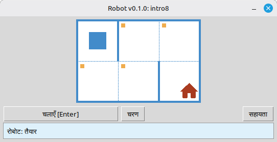

# रोबोट

यह प्रोजेक्ट प्रोग्रामिंग और एल्गोरिदम की मूल बातें सीखने के लिए एक शैक्षिक रोबोट सिम्युलेटर है। छात्र छोटे Python प्रोग्राम लिखते हैं जो रोबोट को ग्रिड पर चलाते हैं, सेलों को रंगते हैं, परिवेश को पढ़ते हैं और डेस्कटॉप विंडो में तुरंत दृश्य प्रतिक्रिया के साथ छोटे कार्य पूरे करते हैं।

यह स्कूली छात्रों और प्रोग्रामिंग सीखने वाले सभी लोगों के लिए है: अनुक्रम, लूप, शर्तें और सरल समस्या-समाधान एक दोस्ताना, खेल जैसे माहौल में।

**वेबसाइट:** [robot.stepindev.com](https://robot.stepindev.com) — कार्य कैटलॉग, कमांड संदर्भ और लेख।

## उदाहरण: कार्य `intro8`



**कार्य:** रोबोट को घर वाली सेल पर ले जाएँ, रास्ते में सभी चिह्नित सेलों को रंगते हुए।

Python में समाधान का उदाहरण:

```python
from robot import *

task("intro8")

move_down()
paint()
move_right()
paint()
move_up()
paint()
move_right()
paint()
move_down()
```

## रोबोट कमांड

**move_right()**  
रोबोट को एक सेल दाएँ ले जाता है।

**move_left()**  
रोबोट को एक सेल बाएँ ले जाता है।

**move_up()**  
रोबोट को एक सेल ऊपर ले जाता है।

**move_down()**  
रोबोट को एक सेल नीचे ले जाता है।

**paint()**  
वर्तमान सेल को रंगता है।

**is_free_left()**  
बाएँ दीवार न हो तो True लौटाता है।

**is_free_right()**  
दाएँ दीवार न हो तो True लौटाता है।

**is_free_up()**  
ऊपर दीवार न हो तो True लौटाता है।

**is_free_down()**  
नीचे दीवार न हो तो True लौटाता है।

**is_wall_left()**  
बाएँ दीवार हो तो True लौटाता है।

**is_wall_right()**  
दाएँ दीवार हो तो True लौटाता है।

**is_wall_up()**  
ऊपर दीवार हो तो True लौटाता है।

**is_wall_down()**  
नीचे दीवार हो तो True लौटाता है।

**is_cell_painted()**  
वर्तमान सेल रंगा हो तो True लौटाता है।

**is_cell_not_painted()**  
वर्तमान सेल रंगा न हो तो True लौटाता है।

**pol()**  
वर्तमान सेल का प्रदूषण मान लौटाता है।

**printn(value)**  
वर्तमान सेल में पूर्णांक दिखाता है।

## `task()` के लिए उपलब्ध कार्य

**पहले कदम**  
intro1, ..., intro24

**फंक्शन्स**  
fun1, ..., fun20

**'for' लूप**  
for1, ..., for28

**'for' लूप और फंक्शन्स**  
forfun1, ..., forfun9

**'while' लूप**  
w1, ..., w51

**'while' लूप और फंक्शन्स**  
wfun1, ..., wfun12

**'if' स्टेटमेंट**  
if1, ..., if14

**'while' लूप और 'if'**  
wif1, ..., wif13

**'if' और 'else'**  
ifelse1, ..., ifelse12

**संयुक्त शर्तें**  
compound1, ..., compound11

## वितरित मॉड्यूल का उपयोग

1. **[GitHub Releases](https://github.com/step-in-dev/robot/releases)** पृष्ठ से मॉड्यूल संग्रह डाउनलोड करें।
2. संग्रह को छात्र के कार्य फ़ोल्डर में निकालें।
3. अपने समाधान फ़ाइल को `robot` पैकेज के पास सहेजें। प्रारंभिक बिंदु के रूप में संग्रह से **`sample_solution.py`** का उपयोग करें।
4. कोई भिन्न अभ्यास चलाने के लिए, **`task()`** को दी जाने वाली स्ट्रिंग बदलें (ऊपर **`task()` के लिए उपलब्ध कार्य** अनुभाग देखें)।

आवश्यकताएँ: **Python 3.7+** मानक लाइब्रेरी के साथ (UI `tkinter` का उपयोग करता है, जो डेस्कटॉप सिस्टम पर अधिकांश Python इंस्टॉलेशन में शामिल होता है)।
