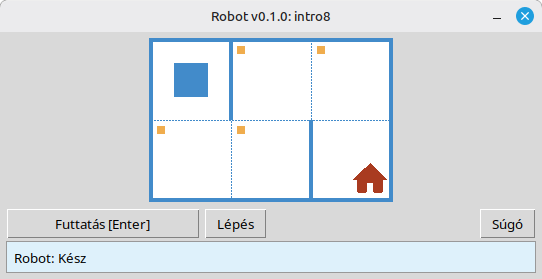

# Robot

Ez a projekt egy oktatási Robot-szimulátor az alapvető programozás és algoritmusok tanulásához. A diákok rövid Python programokat írnak, amelyek mozgatják a Robotot egy rácson, cellákat festenek be, beolvassák a környezetet, és kis feladatokat oldanak meg azonnali vizuális visszajelzéssel egy asztali ablakban.

Iskolai diákoknak és mindenkinek készült, aki most kezd programozni tanulni: szekvenciák, ciklusok, feltételek és egyszerű problémamegoldás barátságos, játékszerű környezetben.

**Weboldal:** [robot.stepindev.com](https://robot.stepindev.com) – feladatkatalógus, parancsreferencia és cikkek.

## Példa: `intro8` feladat



**Feladat:** Mozgasd a Robotot a házat tartalmazó cellára, és közben fesd be az összes jelölt cellát.

Mintamegoldás Pythonban:

```python
from robot import *

task("intro8")

move_down()
paint()
move_right()
paint()
move_up()
paint()
move_right()
paint()
move_down()
```

## A Robot parancsai

**move_right()**  
A Robotot egy cellával jobbra mozgatja.

**move_left()**  
A Robotot egy cellával balra mozgatja.

**move_up()**  
A Robotot egy cellával felfelé mozgatja.

**move_down()**  
A Robotot egy cellával lefelé mozgatja.

**paint()**  
Befesti az aktuális cellát.

**is_free_left()**  
True-t ad vissza, ha balra nincs fal.

**is_free_right()**  
True-t ad vissza, ha jobbra nincs fal.

**is_free_up()**  
True-t ad vissza, ha felfelé nincs fal.

**is_free_down()**  
True-t ad vissza, ha lefelé nincs fal.

**is_wall_left()**  
True-t ad vissza, ha balra fal van.

**is_wall_right()**  
True-t ad vissza, ha jobbra fal van.

**is_wall_up()**  
True-t ad vissza, ha felfelé fal van.

**is_wall_down()**  
True-t ad vissza, ha lefelé fal van.

**is_cell_painted()**  
True-t ad vissza, ha az aktuális cella festett.

**is_cell_not_painted()**  
True-t ad vissza, ha az aktuális cella nincs festve.

**pol()**  
Visszaadja az aktuális cella szennyezettségi szintjét.

**printn(value)**  
Egy egész számot ír ki az aktuális cellában.

## Elérhető feladatok a `task()`-hoz

**Első lépések**  
intro1, …, intro24

**Függvények**  
fun1, …, fun20

**„for” ciklus**  
for1, …, for28

**„for” ciklus és függvények**  
forfun1, …, forfun9

**„while” ciklus**  
w1, …, w51

**„while” ciklus és függvények**  
wfun1, …, wfun12

**„if” utasítás**  
if1, …, if14

**„while” ciklus „if”-fel**  
wif1, …, wif13

**„if” és „else”**  
ifelse1, …, ifelse12

**Összetett feltételek**  
compound1, …, compound11

## A terjesztett modul használata

1. Töltsd le a modul archívumát a **[GitHub Releases](https://github.com/step-in-dev/robot/releases)** oldalról.
2. Csomagold ki az archívumot a diák munkakönyvtárába.
3. Mentsd el a megoldásfájlt a `robot` csomag mellé. Kiindulásként használd az archívumban található **`sample_solution.py`** fájlt.
4. Más feladat futtatásához változtasd meg a **`task()`**-nak átadott szöveget (lásd a fenti **Elérhető feladatok a `task()`-hoz** szakaszt).

Követelmények: **Python 3.7+** a standard könyvtárral (a felhasználói felület a `tkinter`-t használja, amely a legtöbb asztali Python-telepítés része).
