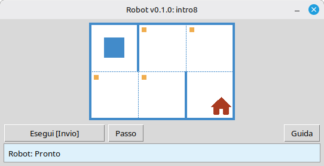

[English](../README.md) | [Русский](./readme_ru.md) | [Беларуская](./readme_be.md) | [Українська](./readme_uk.md) | [Polski](./readme_pl.md) | [Deutsch](./readme_de.md) | [Nederlands](./readme_nl.md) | [Español](./readme_es.md) | [Français](./readme_fr.md) | [Italiano](./readme_it.md) | [Português](./readme_pt.md) | [简体中文](./readme_zh-hans.md) | [繁體中文](./readme_zh-hant.md) | [日本語](./readme_ja.md) | [한국어](./readme_ko.md) | [العربية](./readme_ar.md) | [اردو](./readme_ur.md) | [हिन्दी](./readme_hi.md) | [বাংলা](./readme_bn.md) | [Čeština](./readme_cs.md) | [Türkçe](./readme_tr.md)

# Robot

Questo progetto è un simulatore didattico **Robot** per imparare le basi della programmazione e degli algoritmi. Gli studenti scrivono brevi programmi Python che muovono il Robot su una griglia, colorano celle, leggono l'ambiente e completano piccoli compiti con un feedback visivo immediato in una finestra desktop.

È pensato per **studenti** e per chiunque inizi a programmare: sequenze, cicli, condizioni e semplici problemi da risolvere in un ambiente amichevole e simile a un gioco.

## Esempio: compito `intro8`



**Compito:** Sposta il Robot sulla cella con la casa, colorando ogni cella contrassegnata lungo il percorso.

Esempio di soluzione in Python:

```python
from robot import *

task("intro8")

move_down()
paint()
move_right()
paint()
move_up()
paint()
move_right()
paint()
move_down()
```

## Comandi del Robot

**move_right()**  
Sposta il Robot di una cella a destra.

**move_left()**  
Sposta il Robot di una cella a sinistra.

**move_up()**  
Sposta il Robot di una cella in alto.

**move_down()**  
Sposta il Robot di una cella in basso.

**paint()**  
Colora la cella corrente.

**is_free_left()**  
Restituisce True se a sinistra non c'è un muro.

**is_free_right()**  
Restituisce True se a destra non c'è un muro.

**is_free_up()**  
Restituisce True se sopra non c'è un muro.

**is_free_down()**  
Restituisce True se sotto non c'è un muro.

**is_wall_left()**  
Restituisce True se a sinistra c'è un muro.

**is_wall_right()**  
Restituisce True se a destra c'è un muro.

**is_wall_up()**  
Restituisce True se sopra c'è un muro.

**is_wall_down()**  
Restituisce True se sotto c'è un muro.

**is_cell_painted()**  
Restituisce True se la cella corrente è colorata.

**is_cell_not_painted()**  
Restituisce True se la cella corrente non è colorata.

**pol()**  
Restituisce il livello di inquinamento della cella corrente.

**printn(value)**  
Stampa un intero nella cella corrente.

## Compiti disponibili per `task()`

**Primi passi**  
intro1, ..., intro24

**Funzioni**  
fun1, ..., fun20

**Ciclo 'for'**  
for1, ..., for28

**Ciclo 'for' e funzioni**  
forfun1, ..., forfun9

**Ciclo 'while'**  
w1, ..., w51

**Ciclo 'while' e funzioni**  
wfun1, ..., wfun12

**Istruzione 'if'**  
if1, ..., if14

**Ciclo 'while' con 'if'**  
wif1, ..., wif13

**'if' e 'else'**  
ifelse1, ..., ifelse12

**Condizioni composte**  
compound1, ..., compound11

## Utilizzo del modulo distribuito

1. Scarica l'archivio del modulo dalla pagina **[GitHub Releases](https://github.com/step-in-dev/robot/releases)**.
2. Estrai l'archivio nella cartella di lavoro dello studente.
3. Salva il tuo file di soluzione accanto al pacchetto `robot`. Usa **`sample_solution.py`** dell'archivio come punto di partenza.
4. Per eseguire un esercizio diverso, modifica la stringa passata a **`task()`** (vedi la sezione **Compiti disponibili per `task()`** qui sopra).

Requisiti: **Python 3** con la libreria standard (l'interfaccia utente usa `tkinter`, che è incluso nella maggior parte delle installazioni Python sui sistemi desktop).
