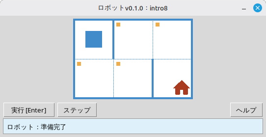

# ロボット

このプロジェクトは、プログラミングとアルゴリズムの基礎を学ぶための教育用 **ロボット** シミュレータです。生徒は Python の短いプログラムを書き、グリッド上でロボットを動かし、マスを塗り、環境を読み取り、デスクトップウィンドウ上で視覚的なフィードバックを得ながら小さな課題を解きます。

**生徒** やプログラミングを学び始めたばかりのすべての人を対象としています。順次実行、ループ、条件分岐、そして簡単な問題解決を、親しみやすいゲームのような環境で学べます。

## 例: 課題 `intro8`



**課題:** ロボットを家のあるマスまで移動させ、途中にあるすべての印のついたマスを塗ってください。

Python による解答例:

```python
from robot import *

task("intro8")

move_down()
paint()
move_right()
paint()
move_up()
paint()
move_right()
paint()
move_down()
```

## ロボットのコマンド

**move_right()**  
ロボットを右に1マス動かします。

**move_left()**  
ロボットを左に1マス動かします。

**move_up()**  
ロボットを上に1マス動かします。

**move_down()**  
ロボットを下に1マス動かします。

**paint()**  
現在のマスを塗ります。

**is_free_left()**  
左に壁がなければ True を返します。

**is_free_right()**  
右に壁がなければ True を返します。

**is_free_up()**  
上に壁がなければ True を返します。

**is_free_down()**  
下に壁がなければ True を返します。

**is_wall_left()**  
左に壁があれば True を返します。

**is_wall_right()**  
右に壁があれば True を返します。

**is_wall_up()**  
上に壁があれば True を返します。

**is_wall_down()**  
下に壁があれば True を返します。

**is_cell_painted()**  
現在のマスが塗られていれば True を返します。

**is_cell_not_painted()**  
現在のマスが塗られていなければ True を返します。

**pol()**  
現在のマスの汚染レベルを返します。

**printn(value)**  
現在のマスに整数を表示します。

## `task()` で利用可能な課題

**入門**  
intro1, ..., intro24

**関数**  
fun1, ..., fun20

**「for」ループ**  
for1, ..., for28

**「for」ループと関数**  
forfun1, ..., forfun9

**「while」ループ**  
w1, ..., w51

**「while」ループと関数**  
wfun1, ..., wfun12

**「if」文**  
if1, ..., if14

**「while」ループと「if」**  
wif1, ..., wif13

**「if」と「else」**  
ifelse1, ..., ifelse12

**複合条件**  
compound1, ..., compound11

## 配布モジュールの使い方

1. **[GitHub Releases](https://github.com/step-in-dev/robot/releases)** ページからモジュールアーカイブをダウンロードします。
2. アーカイブを生徒の作業フォルダに展開します。
3. 解答ファイルを `robot` パッケージの隣に保存します。アーカイブに含まれる **`sample_solution.py`** を出発点として使用してください。
4. 別の演習を実行するには、**`task()`** に渡す文字列を変更します（上記の **`task()` で利用可能な課題** のセクションを参照してください）。

必要な環境: **Python 3** 標準ライブラリ（UI は `tkinter` を使用しており、ほとんどのデスクトップ用 Python インストールに含まれています）。
