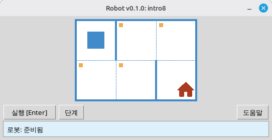

[English](../README.md) | [Русский](./readme_ru.md) | [Беларуская](./readme_be.md) | [Українська](./readme_uk.md) | [Polski](./readme_pl.md) | [Deutsch](./readme_de.md) | [Español](./readme_es.md) | [Français](./readme_fr.md) | [Italiano](./readme_it.md) | [Português](./readme_pt.md) | [简体中文](./readme_zh-hans.md) | [繁體中文](./readme_zh-hant.md) | [日本語](./readme_ja.md) | [한국어](./readme_ko.md) | [العربية](./readme_ar.md) | [اردو](./readme_ur.md) | [हिन्दी](./readme_hi.md) | [বাংলা](./readme_bn.md)

# 로봇

이 프로젝트는 프로그래밍과 알고리즘의 기초를 배우기 위한 교육용 **로봇** 시뮬레이터입니다. 학생들은 Python 짧은 프로그램을 작성하여 격자 위에서 로봇을 이동시키고, 칸을 칠하며, 환경을 읽고, 데스크톱 창에서 즉각적인 시각적 피드백을 통해 작은 과제를 완료합니다.

**학생** 및 프로그래밍을 처음 배우는 모든 사람을 대상으로 합니다. 순차 실행, 반복문, 조건문, 간단한 문제 해결을 친근한 게임 같은 환경에서 학습합니다.

## 예제: `intro8` 과제



**과제:** 로봇을 집이 있는 칸으로 이동시키고, 가는 길에 표시된 모든 칸을 칠하세요.

Python 풀이 예시:

```python
from robot import *

task("intro8")

move_down()
paint()
move_right()
paint()
move_up()
paint()
move_right()
paint()
move_down()
```

## 로봇 명령

**move_right()**  
로봇을 오른쪽으로 한 칸 이동합니다.

**move_left()**  
로봇을 왼쪽으로 한 칸 이동합니다.

**move_up()**  
로봇을 위로 한 칸 이동합니다.

**move_down()**  
로봇을 아래로 한 칸 이동합니다.

**paint()**  
현재 칸을 칠합니다.

**is_free_left()**  
왼쪽에 벽이 없으면 True를 반환합니다.

**is_free_right()**  
오른쪽에 벽이 없으면 True를 반환합니다.

**is_free_up()**  
위쪽에 벽이 없으면 True를 반환합니다.

**is_free_down()**  
아래쪽에 벽이 없으면 True를 반환합니다.

**is_wall_left()**  
왼쪽에 벽이 있으면 True를 반환합니다.

**is_wall_right()**  
오른쪽에 벽이 있으면 True를 반환합니다.

**is_wall_up()**  
위쪽에 벽이 있으면 True를 반환합니다.

**is_wall_down()**  
아래쪽에 벽이 있으면 True를 반환합니다.

**is_cell_painted()**  
현재 칸이 칠해져 있으면 True를 반환합니다.

**is_cell_not_painted()**  
현재 칸이 칠해져 있지 않으면 True를 반환합니다.

**pol()**  
현재 칸의 오염 값을 반환합니다.

**printn(value)**  
현재 칸에 정수를 표시합니다.

## `task()`에서 사용 가능한 과제

**첫 걸음**  
intro1, ..., intro24

**함수**  
fun1, ..., fun20

**'for' 반복문**  
for1, ..., for28

**'for' 반복문과 함수**  
forfun1, ..., forfun9

**'while' 반복문**  
w1, ..., w51

**'while' 반복문과 함수**  
wfun1, ..., wfun12

**'if' 문**  
if1, ..., if14

**'while' 반복문과 'if'**  
wif1, ..., wif13

**'if' 와 'else'**  
ifelse1, ..., ifelse12

**복합 조건**  
compound1, ..., compound11

## 배포 모듈 사용 방법

1. **[GitHub Releases](https://github.com/step-in-dev/robot/releases)** 페이지에서 모듈 아카이브를 다운로드합니다.
2. 아카이브를 학생 작업 폴더에 압축 해제합니다.
3. 풀이 파일을 `robot` 패키지 옆에 저장합니다. 아카이브에 포함된 **`sample_solution.py`** 를 시작점으로 사용하세요.
4. 다른 연습 과제를 실행하려면 **`task()`** 에 전달하는 문자열을 변경하세요(위쪽의 **`task()`에서 사용 가능한 과제** 섹션을 참조하세요).

필요한 환경: **Python 3** 표준 라이브러리 (UI는 `tkinter`를 사용하며, 대부분의 데스크톱 Python 설치에 포함되어 있습니다).
