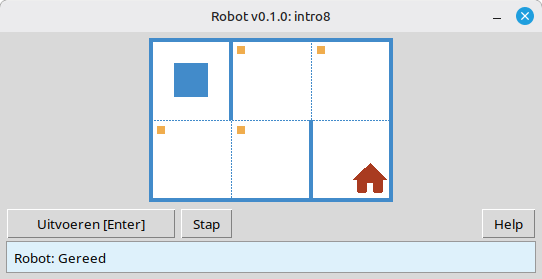

# Robot

Dit project is een educatieve Robot-simulator voor het leren van de basis van programmeren en algoritmen. Leerlingen schrijven korte Python-programma's die de Robot op een raster verplaatsen, cellen verven, de omgeving uitlezen en kleine taken voltooien met directe visuele terugkoppeling in een bureaubladvenster.

Het is bedoeld voor leerlingen en iedereen die begint met programmeren: sequenties, lussen, voorwaarden en eenvoudig probleemoplossen in een vriendelijke, spelachtige omgeving.

**Website:** [robot.stepindev.com](https://robot.stepindev.com) – taakcatalogus, commandoreferentie en artikelen.

## Voorbeeld: taak `intro8`



**Taak:** Verplaats de Robot naar de cel met het huis en verf elke gemarkeerde cel onderweg.

Voorbeeldoplossing in Python:

```python
from robot import *

task("intro8")

move_down()
paint()
move_right()
paint()
move_up()
paint()
move_right()
paint()
move_down()
```

## Robotopdrachten

**move_right()**  
Verplaatst de Robot één cel naar rechts.

**move_left()**  
Verplaatst de Robot één cel naar links.

**move_up()**  
Verplaatst de Robot één cel omhoog.

**move_down()**  
Verplaatst de Robot één cel omlaag.

**paint()**  
Verft de huidige cel.

**is_free_left()**  
Geeft True als links geen muur is.

**is_free_right()**  
Geeft True als rechts geen muur is.

**is_free_up()**  
Geeft True als boven geen muur is.

**is_free_down()**  
Geeft True als onder geen muur is.

**is_wall_left()**  
Geeft True als links een muur is.

**is_wall_right()**  
Geeft True als rechts een muur is.

**is_wall_up()**  
Geeft True als boven een muur is.

**is_wall_down()**  
Geeft True als onder een muur is.

**is_cell_painted()**  
Geeft True als de huidige cel geverfd is.

**is_cell_not_painted()**  
Geeft True als de huidige cel niet geverfd is.

**pol()**  
Geeft de vervuilingswaarde van de huidige cel.

**printn(value)**  
Toont een geheel getal in de huidige cel.

## Beschikbare taken voor `task()`

**Eerste stappen**  
intro1, ..., intro24

**Functies**  
fun1, ..., fun20

**'for'-lus**  
for1, ..., for28

**'for'-lus en functies**  
forfun1, ..., forfun9

**'while'-lus**  
w1, ..., w51

**'while'-lus en functies**  
wfun1, ..., wfun12

**'if'-instructie**  
if1, ..., if14

**'while'-lus met 'if'**  
wif1, ..., wif13

**'if' en 'else'**  
ifelse1, ..., ifelse12

**Samengestelde voorwaarden**  
compound1, ..., compound11

## Gebruik van de gedistribueerde module

1. Download het modulearchief van de **[GitHub Releases](https://github.com/step-in-dev/robot/releases)** pagina.
2. Pak het archief uit in de werkmap van de leerling.
3. Sla je oplossingsbestand op naast het `robot`-pakket. Gebruik **`sample_solution.py`** uit het archief als startpunt.
4. Om een andere oefening uit te voeren, wijzig je de tekenreeks die aan **`task()`** wordt doorgegeven (zie de sectie **Beschikbare taken voor `task()`** hierboven).

Vereisten: **Python 3.7+** met de standaardbibliotheek (de interface gebruikt `tkinter`, dat bij de meeste Python-installaties op desktopsystemen is inbegrepen).
