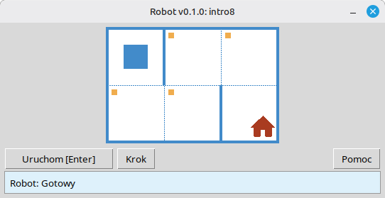

[English](../README.md) | [Русский](./readme_ru.md) | [Беларуская](./readme_be.md) | [Українська](./readme_uk.md) | [Polski](./readme_pl.md) | [Deutsch](./readme_de.md) | [Español](./readme_es.md) | [Français](./readme_fr.md) | [Português](./readme_pt.md) | [简体中文](./readme_zh-hans.md) | [繁體中文](./readme_zh-hant.md) | [日本語](./readme_ja.md)

# Robot

Ten projekt to edukacyjny symulator **Robota** do nauki podstaw programowania i algorytmów. Uczniowie piszą krótkie programy w Pythonie, które poruszają Robotem na siatce, malują komórki, odczytują stan środowiska i rozwiązują małe zadania z natychmiastową wizualną informacją zwrotną w oknie aplikacji.

Przeznaczony jest dla **uczniów** i wszystkich, którzy zaczynają naukę programowania: sekwencje, pętle, warunki i proste rozwiązywanie problemów w przyjaznym, przypominającym grę otoczeniu.

## Przykład: zadanie `intro8`



**Zadanie:** Przesuń Robota na komórkę z domem, malując po drodze wszystkie oznaczone komórki.

Przykładowe rozwiązanie w Pythonie:

```python
from robot import *

task("intro8")

move_down()
paint()
move_right()
paint()
move_up()
paint()
move_right()
paint()
move_down()
```

## Polecenia Robota

**move_right()**  
Przesuwa Robota o jedną komórkę w prawo.

**move_left()**  
Przesuwa Robota o jedną komórkę w lewo.

**move_up()**  
Przesuwa Robota o jedną komórkę w górę.

**move_down()**  
Przesuwa Robota o jedną komórkę w dół.

**paint()**  
Maluje bieżącą komórkę.

**is_free_left()**  
Zwraca True, jeśli po lewej nie ma ściany.

**is_free_right()**  
Zwraca True, jeśli po prawej nie ma ściany.

**is_free_up()**  
Zwraca True, jeśli u góry nie ma ściany.

**is_free_down()**  
Zwraca True, jeśli u dołu nie ma ściany.

**is_wall_left()**  
Zwraca True, jeśli po lewej jest ściana.

**is_wall_right()**  
Zwraca True, jeśli po prawej jest ściana.

**is_wall_up()**  
Zwraca True, jeśli u góry jest ściana.

**is_wall_down()**  
Zwraca True, jeśli u dołu jest ściana.

**is_cell_painted()**  
Zwraca True, jeśli bieżąca komórka jest pomalowana.

**is_cell_not_painted()**  
Zwraca True, jeśli bieżąca komórka nie jest pomalowana.

**pol()**  
Zwraca poziom zanieczyszczenia bieżącej komórki.

**printn(value)**  
Wyświetla liczbę całkowitą w bieżącej komórce.

## Dostępne zadania dla `task()`

**Pierwsze kroki**  
intro1, ..., intro24

**Funkcje**  
fun1, ..., fun20

**Pętla „for”**  
for1, ..., for28

**Pętla „for” i funkcje**  
forfun1, ..., forfun9

**Pętla „while”**  
w1, ..., w51

**Pętla „while” i funkcje**  
wfun1, ..., wfun12

**Instrukcja „if”**  
if1, ..., if14

**Pętla „while” z instrukcją „if”**  
wif1, ..., wif13

**„if” i „else”**  
ifelse1, ..., ifelse12

**Warunki złożone**  
compound1, ..., compound11

## Korzystanie z modułu dystrybucyjnego

1. Pobierz archiwum modułu ze strony **[GitHub Releases](https://github.com/step-in-dev/robot/releases)**.
2. Rozpakuj archiwum do folderu roboczego ucznia.
3. Zapisz plik z rozwiązaniem obok pakietu `robot`. Użyj pliku **`sample_solution.py`** z archiwum jako punktu wyjścia.
4. Aby uruchomić inne ćwiczenie, zmień łańcuch przekazywany do **`task()`** (zobacz sekcję **Dostępne zadania dla `task()`** powyżej).

Wymagania: **Python 3** z biblioteką standardową (interfejs używa `tkinter`, który jest dołączony do większości instalacji Pythona na komputerach stacjonarnych).
