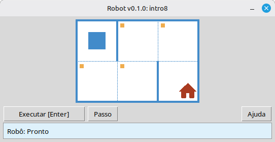

[English](../README.md) | [Русский](./readme_ru.md) | [Беларуская](./readme_be.md) | [Українська](./readme_uk.md) | [Polski](./readme_pl.md) | [Deutsch](./readme_de.md) | [Nederlands](./readme_nl.md) | [Español](./readme_es.md) | [Français](./readme_fr.md) | [Italiano](./readme_it.md) | [Português](./readme_pt.md) | [简体中文](./readme_zh-hans.md) | [繁體中文](./readme_zh-hant.md) | [日本語](./readme_ja.md) | [한국어](./readme_ko.md) | [العربية](./readme_ar.md) | [اردو](./readme_ur.md) | [हिन्दी](./readme_hi.md) | [বাংলা](./readme_bn.md) | [Čeština](./readme_cs.md) | [Türkçe](./readme_tr.md)

# Robô

Este projeto é um simulador educacional do **Robô** para aprender os fundamentos da programação e de algoritmos. Os alunos escrevem programas curtos em Python que movem o Robô por uma grade, pintam células, leem o ambiente e completam pequenas tarefas com retorno visual imediato em uma janela de ambiente de trabalho.

Ele é destinado a **alunos de escola** e qualquer pessoa que esteja começando a aprender programação: sequências, laços, condições e resolução simples de problemas em um ambiente amigável, semelhante a um jogo.

## Exemplo: tarefa `intro8`



**Tarefa:** Mova o Robô para a célula com a casa, pintando cada célula marcada ao longo do caminho.

Solução de exemplo em Python:

```python
from robot import *

task("intro8")

move_down()
paint()
move_right()
paint()
move_up()
paint()
move_right()
paint()
move_down()
```

## Comandos do Robô

**move_right()**  
Move o Robô uma célula para a direita.

**move_left()**  
Move o Robô uma célula para a esquerda.

**move_up()**  
Move o Robô uma célula para cima.

**move_down()**  
Move o Robô uma célula para baixo.

**paint()**  
Pinta a célula atual.

**is_free_left()**  
Retorna True se não houver parede à esquerda.

**is_free_right()**  
Retorna True se não houver parede à direita.

**is_free_up()**  
Retorna True se não houver parede acima.

**is_free_down()**  
Retorna True se não houver parede abaixo.

**is_wall_left()**  
Retorna True se houver parede à esquerda.

**is_wall_right()**  
Retorna True se houver parede à direita.

**is_wall_up()**  
Retorna True se houver parede acima.

**is_wall_down()**  
Retorna True se houver parede abaixo.

**is_cell_painted()**  
Retorna True se a célula atual estiver pintada.

**is_cell_not_painted()**  
Retorna True se a célula atual não estiver pintada.

**pol()**  
Retorna o nível de poluição da célula atual.

**printn(value)**  
Exibe um inteiro na célula atual.

## Tarefas disponíveis para `task()`

**Primeiros passos**  
intro1, …, intro24

**Funções**  
fun1, …, fun20

**Loop 'for'**  
for1, …, for28

**Loop 'for' e funções**  
forfun1, …, forfun9

**Loop 'while'**  
w1, …, w51

**Loop 'while' e funções**  
wfun1, …, wfun12

**Instrução 'if'**  
if1, …, if14

**Loop 'while' com 'if'**  
wif1, …, wif13

**'if' e 'else'**  
ifelse1, …, ifelse12

**Condições compostas**  
compound1, …, compound11

## Como usar o módulo distribuído

1. Baixe o arquivo do módulo na página **[GitHub Releases](https://github.com/step-in-dev/robot/releases)**.
2. Extraia o arquivo na pasta de trabalho do aluno.
3. Salve seu arquivo de solução junto ao pacote `robot`. Use **`sample_solution.py`** do arquivo como ponto de partida.
4. Para executar um exercício diferente, altere a string passada para **`task()`** (consulte a seção **Tarefas disponíveis para `task()`** acima).

Requisitos: **Python 3** com a biblioteca padrão (a interface usa `tkinter`, que está incluída na maioria das instalações de Python em sistemas de ambiente de trabalho).
