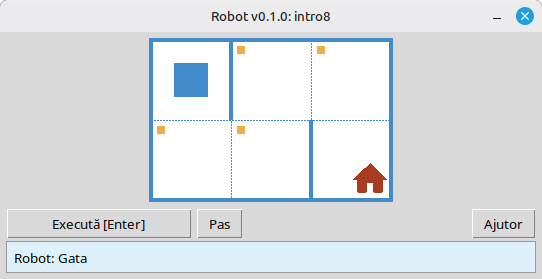

# Robot

Acest proiect este un simulator educațional Robot pentru învățarea programării de bază și a algoritmilor. Elevii scriu scurte programe Python care mută Robotul pe o grilă, vopsesc celule, citesc mediul și îndeplinesc sarcini mici cu feedback vizual imediat într-o fereastră desktop.

Este destinat elevilor și oricui începe să învețe programare: secvențiere, bucle, condiții și rezolvarea simplă de probleme într-un cadru prietenos, de tip joc.

**Site:** [robot.stepindev.com](https://robot.stepindev.com) – catalog de sarcini, referință de comenzi și articole.

## Exemplu: sarcina `intro8`



**Sarcină:** Mută Robotul pe celula cu casa, vopsind fiecare celulă marcată de-a lungul drumului.

Exemplu de soluție în Python:

```python
from robot import *

task("intro8")

move_down()
paint()
move_right()
paint()
move_up()
paint()
move_right()
paint()
move_down()
```

## Comenzile Robotului

**move_right()**  
Mută Robotul cu o celulă la dreapta.

**move_left()**  
Mută Robotul cu o celulă la stânga.

**move_up()**  
Mută Robotul cu o celulă în sus.

**move_down()**  
Mută Robotul cu o celulă în jos.

**paint()**  
Vopsește celula curentă.

**is_free_left()**  
Returnează True dacă nu există perete la stânga.

**is_free_right()**  
Returnează True dacă nu există perete la dreapta.

**is_free_up()**  
Returnează True dacă nu există perete deasupra.

**is_free_down()**  
Returnează True dacă nu există perete dedesubt.

**is_wall_left()**  
Returnează True dacă există perete la stânga.

**is_wall_right()**  
Returnează True dacă există perete la dreapta.

**is_wall_up()**  
Returnează True dacă există perete deasupra.

**is_wall_down()**  
Returnează True dacă există perete dedesubt.

**is_cell_painted()**  
Returnează True dacă celula curentă este vopsită.

**is_cell_not_painted()**  
Returnează True dacă celula curentă nu este vopsită.

**pol()**  
Returnează nivelul de poluare al celulei curente.

**printn(value)**  
Afișează un număr întreg în celula curentă.

## Sarcini disponibile pentru `task()`

**Primii pași**  
intro1, ..., intro24

**Funcții**  
fun1, ..., fun20

**Bucla „for”**  
for1, ..., for28

**Bucla „for” și funcții**  
forfun1, ..., forfun9

**Bucla „while”**  
w1, ..., w51

**Bucla „while” și funcții**  
wfun1, ..., wfun12

**Instrucțiunea „if”**  
if1, ..., if14

**Bucla „while” cu „if”**  
wif1, ..., wif13

**„if” și „else”**  
ifelse1, ..., ifelse12

**Condiții compuse**  
compound1, ..., compound11

## Utilizarea modulului distribuit

1. Descărcați arhiva modulului de pe pagina **[GitHub Releases](https://github.com/step-in-dev/robot/releases)**.
2. Extrageți arhiva în dosarul de lucru al elevului.
3. Salvați fișierul soluție alături de modulul `robot`. Folosiți **`sample_solution.py`** din arhivă ca punct de plecare.
4. Pentru a rula un exercițiu diferit, modificați șirul transmis către **`task()`** (consultați secțiunea **Sarcini disponibile pentru `task()`** de mai sus).

Cerințe: **Python 3.7+** cu biblioteca standard (interfața folosește `tkinter`, care este inclusă în majoritatea instalărilor Python pe sistemele desktop).
