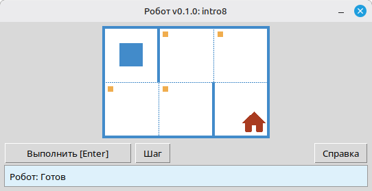

[English](../README.md) | [Русский](./readme_ru.md) | [Беларуская](./readme_be.md) | [Українська](./readme_uk.md) | [Polski](./readme_pl.md) | [Deutsch](./readme_de.md) | [Español](./readme_es.md) | [Français](./readme_fr.md) | [Português](./readme_pt.md) | [简体中文](./readme_zh-hans.md) | [繁體中文](./readme_zh-hant.md) | [日本語](./readme_ja.md)

# Робот

Проект представляет собой учебный симулятор **Робота** для освоения основ программирования и алгоритмизации. Учащиеся пишут короткие программы на Python, которые управляют Роботом на клетчатом поле: перемещают его, закрашивают клетки, считывают состояние обстановки и решают небольшие задачи с наглядной обратной связью в окне приложения.

Предназначен для **школьников** и всех, кто начинает изучать программирование: последовательности действий, циклы, условия и решение простых задач в дружелюбной игровой среде.

## Пример: задание `intro8`



**Задание:** Переместите Робота на клетку с домом, закрашивая по пути все отмеченные клетки.

Пример решения на Python:

```python
from robot import *

task("intro8")

move_down()
paint()
move_right()
paint()
move_up()
paint()
move_right()
paint()
move_down()
```

## Команды Робота

**move_right()**  
Сдвигает Робота на одну клетку вправо.

**move_left()**  
Сдвигает Робота на одну клетку влево.

**move_up()**  
Сдвигает Робота на одну клетку вверх.

**move_down()**  
Сдвигает Робота на одну клетку вниз.

**paint()**  
Закрашивает текущую клетку.

**is_free_left()**  
Возвращает True, если слева нет стены.

**is_free_right()**  
Возвращает True, если справа нет стены.

**is_free_up()**  
Возвращает True, если сверху нет стены.

**is_free_down()**  
Возвращает True, если снизу нет стены.

**is_wall_left()**  
Возвращает True, если слева стена.

**is_wall_right()**  
Возвращает True, если справа стена.

**is_wall_up()**  
Возвращает True, если сверху стена.

**is_wall_down()**  
Возвращает True, если снизу стена.

**is_cell_painted()**  
Возвращает True, если текущая клетка закрашена.

**is_cell_not_painted()**  
Возвращает True, если текущая клетка не закрашена.

**pol()**  
Возвращает уровень загрязнения текущей клетки.

**printn(value)**  
Выводит целое число в текущей клетке.

## Доступные задания для `task()`

**Первые шаги**  
intro1, ..., intro24

**Функции**  
fun1, ..., fun20

**Цикл «for»**  
for1, ..., for28

**Цикл «for» и функции**  
forfun1, ..., forfun9

**Цикл «while»**  
w1, ..., w51

**Цикл «while» и функции**  
wfun1, ..., wfun12

**Конструкция «if»**  
if1, ..., if14

**Цикл «while» с конструкцией «if»**  
wif1, ..., wif13

**«if» и «else»**  
ifelse1, ..., ifelse12

**Составные условия**  
compound1, ..., compound11

## Использование распространяемого модуля

1. Скачайте архив модуля со страницы **[GitHub Releases](https://github.com/step-in-dev/robot/releases)**.
2. Распакуйте архив в рабочую папку учащегося.
3. Сохраните файл с решением рядом с пакетом `robot`. В качестве отправной точки используйте файл **`sample_solution.py`** из архива.
4. Чтобы запустить другое упражнение, измените строку, передаваемую в **`task()`** (см. раздел **Доступные задания для `task()`** выше).

Требования: **Python 3** со стандартной библиотекой (интерфейс использует `tkinter`, который входит в большинство установок Python на настольных системах).
