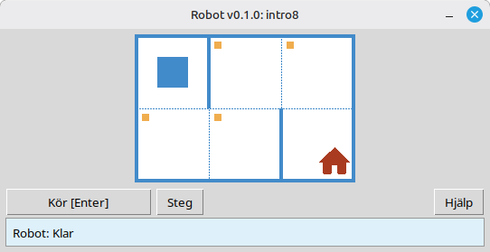

# Robot

Detta projekt är en pedagogisk Robot-simulator för att lära sig grunderna i programmering och algoritmer. Elever skriver korta Python-program som flyttar Roboten på ett rutnät, målar celler, läser av miljön och löser små uppgifter med omedelbar visuell återkoppling i ett fönster.

Det är avsett för skolelever och alla som börjar lära sig programmering: sekvenser, loopar, villkor och enkel problemlösning i en vänlig, spelliknande miljö.

**Webbplats:** [robot.stepindev.com](https://robot.stepindev.com) – uppgiftskatalog, kommandoreferens och artiklar.

## Exempel: uppgift `intro8`



**Uppgift:** Flytta Roboten till cellen med huset och måla varje markerad cell längs vägen.

Exempellösning i Python:

```python
from robot import *

task("intro8")

move_down()
paint()
move_right()
paint()
move_up()
paint()
move_right()
paint()
move_down()
```

## Robotkommandon

**move_right()**  
Flyttar Roboten en cell till höger.

**move_left()**  
Flyttar Roboten en cell till vänster.

**move_up()**  
Flyttar Roboten en cell uppåt.

**move_down()**  
Flyttar Roboten en cell nedåt.

**paint()**  
Målar den aktuella cellen.

**is_free_left()**  
Returnerar True om det inte finns en vägg till vänster.

**is_free_right()**  
Returnerar True om det inte finns en vägg till höger.

**is_free_up()**  
Returnerar True om det inte finns en vägg ovanför.

**is_free_down()**  
Returnerar True om det inte finns en vägg nedanför.

**is_wall_left()**  
Returnerar True om det finns en vägg till vänster.

**is_wall_right()**  
Returnerar True om det finns en vägg till höger.

**is_wall_up()**  
Returnerar True om det finns en vägg ovanför.

**is_wall_down()**  
Returnerar True om det finns en vägg nedanför.

**is_cell_painted()**  
Returnerar True om den aktuella cellen är målad.

**is_cell_not_painted()**  
Returnerar True om den aktuella cellen inte är målad.

**pol()**  
Returnerar föroreningsvärdet för den aktuella cellen.

**printn(value)**  
Skriver ut ett heltal i den aktuella cellen.

## Tillgängliga uppgifter för `task()`

**Första stegen**  
intro1, ..., intro24

**Funktioner**  
fun1, ..., fun20

**'for'-loop**  
for1, ..., for28

**'for'-loop och funktioner**  
forfun1, ..., forfun9

**'while'-loop**  
w1, ..., w51

**'while'-loop och funktioner**  
wfun1, ..., wfun12

**'if'-sats**  
if1, ..., if14

**'while'-loop med 'if'**  
wif1, ..., wif13

**'if' och 'else'**  
ifelse1, ..., ifelse12

**Sammansatta villkor**  
compound1, ..., compound11

## Användning av den distribuerade modulen

1. Ladda ner modularkivet från sidan **[GitHub Releases](https://github.com/step-in-dev/robot/releases)**.
2. Packa upp arkivet i elevens arbetsmapp.
3. Spara din lösningsfil bredvid `robot`-paketet. Använd **`sample_solution.py`** från arkivet som utgångspunkt.
4. För att köra en annan övning, ändra strängen som skickas till **`task()`** (se avsnittet **Tillgängliga uppgifter för `task()`** ovan).

Krav: **Python 3.7+** med standardbiblioteket (användargränssnittet använder `tkinter`, som ingår i de flesta Python-installationer på datorsystem).
