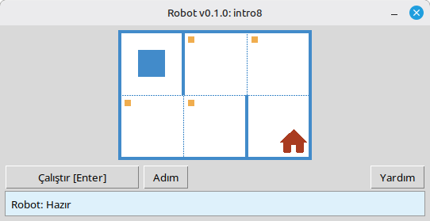

# Robot

Bu proje, temel programlama ve algoritmaları öğrenmek için eğitim amaçlı bir Robot simülatörüdür. Öğrenciler, Robotu bir ızgara üzerinde hareket ettiren, hücreleri boyayan, ortamı okuyan ve masaüstü penceresinde anında görsel geri bildirimle küçük görevleri tamamlayan kısa Python programları yazarlar.

Okul öğrencileri ve programlamayı öğrenmeye yeni başlayan herkes için tasarlanmıştır: sıralama, döngüler, koşullar ve dostane, oyun benzeri bir ortamda basit problem çözme.

**Web sitesi:** [robot.stepindev.com](https://robot.stepindev.com) – görev kataloğu, komut referansı ve makaleler.

## Örnek: `intro8` görevi



**Görev:** Robotu evin bulunduğu hücreye götürün, yol boyunca her işaretli hücreyi boyayın.

Python'da örnek çözüm:

```python
from robot import *

task("intro8")

move_down()
paint()
move_right()
paint()
move_up()
paint()
move_right()
paint()
move_down()
```

## Robot Komutları

**move_right()**  
Robotu bir hücre sağa kaydırır.

**move_left()**  
Robotu bir hücre sola kaydırır.

**move_up()**  
Robotu bir hücre yukarı kaydırır.

**move_down()**  
Robotu bir hücre aşağı kaydırır.

**paint()**  
Mevcut hücreyi boyar.

**is_free_left()**  
Solda duvar yoksa True döner.

**is_free_right()**  
Sağda duvar yoksa True döner.

**is_free_up()**  
Yukarıda duvar yoksa True döner.

**is_free_down()**  
Aşağıda duvar yoksa True döner.

**is_wall_left()**  
Solda duvar varsa True döner.

**is_wall_right()**  
Sağda duvar varsa True döner.

**is_wall_up()**  
Yukarıda duvar varsa True döner.

**is_wall_down()**  
Aşağıda duvar varsa True döner.

**is_cell_painted()**  
Mevcut hücre boyanmışsa True döner.

**is_cell_not_painted()**  
Mevcut hücre boyanmamışsa True döner.

**pol()**  
Mevcut hücrenin kirlilik değerini döner.

**printn(value)**  
Mevcut hücrede bir tamsayı yazdırır.

## `task()` için Kullanılabilir Görevler

**İlk Adımlar**  
intro1, ..., intro24

**Fonksiyonlar**  
fun1, ..., fun20

**“for” döngüsü**  
for1, ..., for28

**“for” döngüsü ve fonksiyonlar**  
forfun1, ..., forfun9

**“while” döngüsü**  
w1, ..., w51

**“while” döngüsü ve fonksiyonlar**  
wfun1, ..., wfun12

**“if” ifadesi**  
if1, ..., if14

**“while” döngüsü ile “if”**  
wif1, ..., wif15

**“if” ve “else”**  
ifelse1, ..., ifelse10

**Birleşik Koşullar**  
compound1, ..., compound11

## Dağıtılan Modülün Kullanımı

1. Modül arşivini **[GitHub Releases](https://github.com/step-in-dev/robot/releases)** sayfasından indirin.
2. Arşivi öğrencinin çalışma klasörüne çıkartın.
3. Çözüm dosyanızı `robot` modülünün yanına kaydedin. Başlangıç noktası olarak arşivdeki **`sample_solution.py`** dosyasını kullanın.
4. Farklı bir alıştırma çalıştırmak için **`task()`** fonksiyonuna iletilen dizeyi değiştirin (yukarıdaki **`task()` için Kullanılabilir Görevler** bölümüne bakın).

Gereksinimler: Standart kütüphaneli **Python 3.7+** (arayüz `tkinter` kullanır, bu da masaüstü sistemlerdeki çoğu Python kurulumunda bulunur).
