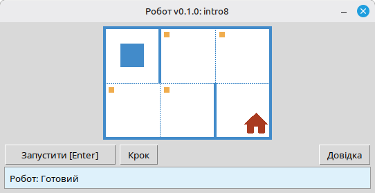

# Робот

Проєкт — це навчальний виконавець **Робот** для засвоєння основ програмування та алгоритмізації. Учні пишуть короткі програми мовою Python, які керують Роботом на клітчастому полі: переміщують його, фарбують клітинки, зчитують стан середовища й розв’язують невеликі завдання з наочною зворотною зв’язкою у вікні виконавця.

Призначений для **школярів** і всіх, хто починає вивчати програмування: послідовності дій, цикли, умови та розв’язання простих задач у дружньому ігровому середовищі.

## Приклад: завдання `intro8`



**Завдання:** Перемістіть Робота на клітинку з будинком, фарбуючи по дорозі всі позначені клітинки.

Приклад розв’язання на Python:

```python
from robot import *

task("intro8")

move_down()
paint()
move_right()
paint()
move_up()
paint()
move_right()
paint()
move_down()
```

## Команди Робота

**move_right()**  
Зсуває Робота на одну клітинку вправо.

**move_left()**  
Зсуває Робота на одну клітинку вліво.

**move_up()**  
Зсуває Робота на одну клітинку вгору.

**move_down()**  
Зсуває Робота на одну клітинку вниз.

**paint()**  
Фарбує поточну клітинку.

**is_free_left()**  
Повертає True, якщо зліва немає стіни.

**is_free_right()**  
Повертає True, якщо справа немає стіни.

**is_free_up()**  
Повертає True, якщо зверху немає стіни.

**is_free_down()**  
Повертає True, якщо знизу немає стіни.

**is_wall_left()**  
Повертає True, якщо зліва стіна.

**is_wall_right()**  
Повертає True, якщо справа стіна.

**is_wall_up()**  
Повертає True, якщо зверху стіна.

**is_wall_down()**  
Повертає True, якщо знизу стіна.

**is_cell_painted()**  
Повертає True, якщо поточна клітина пофарбована.

**is_cell_not_painted()**  
Повертає True, якщо поточна клітина не пофарбована.

**pol()**  
Повертає рівень забруднення поточної клітини.

**printn(value)**  
Виводить ціле число в поточній клітині.

## Доступні завдання для `task()`

**Перші кроки**  
intro1, ..., intro24

**Функції**  
fun1, ..., fun20

**Цикл «for»**  
for1, ..., for28

**Цикл «for» і функції**  
forfun1, ..., forfun9

**Цикл «while»**  
w1, ..., w51

**Цикл «while» і функції**  
wfun1, ..., wfun12

**Конструкція «if»**  
if1, ..., if14

**Цикл «while» з конструкцією «if»**  
wif1, ..., wif13

**«if» і «else»**  
ifelse1, ..., ifelse12

**Складні умови**  
compound1, ..., compound11

## Використання модуля для розповсюдження

1. Завантажте архів модуля зі сторінки **[GitHub Releases](https://github.com/step-in-dev/robot/releases)**.
2. Розпакуйте архів до робочої теки учня.
3. Збережіть файл із розв’язанням поруч із пакетом `robot`. Як відправну точку використовуйте файл **`sample_solution.py`** з архіву.
4. Щоб запустити іншу вправу, змініть рядок, який передається в **`task()`** (див. розділ **Доступні завдання для `task()`** вище).

Вимоги: **Python 3.7+** зі стандартною бібліотекою (інтерфейс використовує `tkinter`, який входить до більшості встановлень Python на настільних системах).
