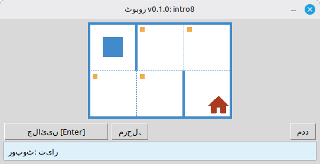

# روبوٹ

یہ منصوبہ بنیادی پروگرامنگ اور الگورتھم سیکھنے کے لیے ایک تعلیمی روبوٹ ایکزی کیوٹر ہے۔ طلباء مختصر ⁦Python⁩ پروگرام لکھتے ہیں جو روبوٹ کو گرِڈ پر منتقل کرتے، خانوں کو رنگتے، ماحول پڑھتے، اور چھوٹے کام مکمل کرتے ہیں، جس کا فوری بصری نتیجہ ڈیسک ٹاپ ونڈو میں دکھایا جاتا ہے۔

یہ سکول کے طلباء اور ہر اس شخص کے لیے ہے جو پروگرامنگ سیکھنا شروع کر رہا ہے: ترتیب، لوپس، شرائط، اور سادہ مسائل کا حل ایک دوستانہ، کھیل جیسی ترتیب میں۔

**ویب سائٹ:** [⁦robot.stepindev.com⁩](https://robot.stepindev.com) – ٹاسک کیٹلاگ، کمانڈ حوالہ اور مضامین۔

## مثال: کام ⁦intro8⁩



**کام:** روبوٹ کو گھر والے خانے تک لے جائیں، راستے میں ہر نشان زدہ خانے کو رنگتے ہوئے۔

⁦Python⁩ میں مثال کا حل:

```python
from robot import *

task("intro8")

move_down()
paint()
move_right()
paint()
move_up()
paint()
move_right()
paint()
move_down()
```

## روبوٹ کے احکامات

**move_right()**  
روبوٹ کو ایک خانہ دائیں منتقل کرتا ہے۔

**move_left()**  
روبوٹ کو ایک خانہ بائیں منتقل کرتا ہے۔

**move_up()**  
روبوٹ کو ایک خانہ اوپر منتقل کرتا ہے۔

**move_down()**  
روبوٹ کو ایک خانہ نیچے منتقل کرتا ہے۔

**paint()**  
موجودہ خانے کو رنگتا ہے۔

**is_free_left()**  
اگر بائیں دیوار نہ ہو تو ⁦True⁩ واپس کرتا ہے۔

**is_free_right()**  
اگر دائیں دیوار نہ ہو تو ⁦True⁩ واپس کرتا ہے۔

**is_free_up()**  
اگر اوپر دیوار نہ ہو تو ⁦True⁩ واپس کرتا ہے۔

**is_free_down()**  
اگر نیچے دیوار نہ ہو تو ⁦True⁩ واپس کرتا ہے۔

**is_wall_left()**  
اگر بائیں دیوار ہو تو ⁦True⁩ واپس کرتا ہے۔

**is_wall_right()**  
اگر دائیں دیوار ہو تو ⁦True⁩ واپس کرتا ہے۔

**is_wall_up()**  
اگر اوپر دیوار ہو تو ⁦True⁩ واپس کرتا ہے۔

**is_wall_down()**  
اگر نیچے دیوار ہو تو ⁦True⁩ واپس کرتا ہے۔

**is_cell_painted()**  
اگر موجودہ خانہ رنگا ہوا ہو تو ⁦True⁩ واپس کرتا ہے۔

**is_cell_not_painted()**  
اگر موجودہ خانہ رنگا ہوا نہ ہو تو ⁦True⁩ واپس کرتا ہے۔

**pol()**  
موجودہ خانے کی آلودگی کی سطح واپس کرتا ہے۔

**printn(value)**  
موجودہ خانے میں ایک عدد صحیح دکھاتا ہے۔

## ⁦task()⁩ کے لیے دستیاب کام

**پہلے قدم**  
intro1, ..., intro24

**فنکشنز**  
fun1, ..., fun20

**لوپ «⁦for⁩»**  
for1, ..., for28

**لوپ «⁦for⁩» اور فنکشنز**  
forfun1, ..., forfun9

**لوپ «⁦while⁩»**  
w1, ..., w51

**لوپ «⁦while⁩» اور فنکشنز**  
wfun1, ..., wfun12

**بیان «⁦if⁩»**  
if1, ..., if14

**لوپ «⁦while⁩» اور «⁦if⁩»**  
wif1, ..., wif15

**«⁦if⁩» اور «⁦else⁩»**  
ifelse1, ..., ifelse10

**مرکب شرائط**  
compound1, ..., compound11

## تقسیم شدہ ماڈیول کا استعمال

1. ماڈیول آرکائیو **[⁦GitHub Releases⁩](https://github.com/step-in-dev/robot/releases)** صفحے سے ڈاؤن لوڈ کریں۔
2. آرکائیو کو طالب علم کے ورکنگ فولڈر میں نکالیں۔
3. اپنی حل فائل ⁦robot⁩ ماڈیول کے ساتھ محفوظ کریں۔ آغاز کے لیے آرکائیو میں موجود **⁦sample_solution.py⁩** فائل استعمال کریں۔
4. کوئی اور مشق چلانے کے لیے **⁦task()⁩** کو دی جانے والی سٹرنگ تبدیل کریں (اوپر **⁦task()⁩ کے لیے دستیاب کام** سیکشن دیکھیں)۔

ضروریات: **⁦Python 3.7+⁩** مع معیاری لائبریری (یوزر انٹرفیس ⁦tkinter⁩ استعمال کرتا ہے، جو زیادہ تر ڈیسک ٹاپ سسٹمز پر ⁦Python⁩ کی تنصیب کے ساتھ شامل ہوتا ہے)۔
