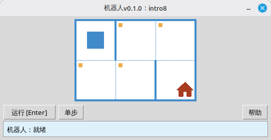

[English](../README.md) | [Русский](./readme_ru.md) | [Беларуская](./readme_be.md) | [Українська](./readme_uk.md) | [Polski](./readme_pl.md) | [Deutsch](./readme_de.md) | [Español](./readme_es.md) | [Français](./readme_fr.md) | [Italiano](./readme_it.md) | [Português](./readme_pt.md) | [简体中文](./readme_zh-hans.md) | [繁體中文](./readme_zh-hant.md) | [日本語](./readme_ja.md) | [한국어](./readme_ko.md) | [العربية](./readme_ar.md) | [اردو](./readme_ur.md) | [हिन्दी](./readme_hi.md) | [বাংলা](./readme_bn.md) | [Čeština](./readme_cs.md) | [Türkçe](./readme_tr.md)

# 机器人

本项目是一个用于学习编程与算法基础的教学用**机器人**模拟器。学生编写简短的 Python 程序，控制机器人在格状场地上移动、着色格子、读取环境状态，并完成小型课题，同时通过桌面窗口获得即时的视觉反馈。

面向**学生**以及所有编程初学者，在友好的游戏式环境中练习顺序执行、循环、条件以及简单问题的求解。

## 示例：任务 `intro8`



**任务：**将机器人移动到有房子的格子上，并沿路着色所有待着色的格子。

Python 示例解答：

```python
from robot import *

task("intro8")

move_down()
paint()
move_right()
paint()
move_up()
paint()
move_right()
paint()
move_down()
```

## 机器人命令

**move_right()**  
将机器人向右移动一格。

**move_left()**  
将机器人向左移动一格。

**move_up()**  
将机器人向上移动一格。

**move_down()**  
将机器人向下移动一格。

**paint()**  
给当前格子着色。

**is_free_left()**  
若左侧没有墙则返回 True。

**is_free_right()**  
若右侧没有墙则返回 True。

**is_free_up()**  
若上方没有墙则返回 True。

**is_free_down()**  
若下方没有墙则返回 True。

**is_wall_left()**  
若左侧有墙则返回 True。

**is_wall_right()**  
若右侧有墙则返回 True。

**is_wall_up()**  
若上方有墙则返回 True。

**is_wall_down()**  
若下方有墙则返回 True。

**is_cell_painted()**  
若当前格子已着色则返回 True。

**is_cell_not_painted()**  
若当前格子未着色则返回 True。

**pol()**  
返回当前格子的污染值。

**printn(value)**  
在当前格子中显示整数。

## 可用于 `task()` 的课题

**入门**  
intro1, ..., intro24

**函数**  
fun1, ..., fun20

**「for」循环**  
for1, ..., for28

**「for」循环与函数**  
forfun1, ..., forfun9

**「while」循环**  
w1, ..., w51

**「while」循环与函数**  
wfun1, ..., wfun12

**「if」语句**  
if1, ..., if14

**「while」循环与「if」**  
wif1, ..., wif13

**「if」和「else」**  
ifelse1, ..., ifelse12

**复合条件**  
compound1, ..., compound11

## 使用分发包

1. 从 **[GitHub Releases](https://github.com/step-in-dev/robot/releases)** 页面下载模块压缩包。
2. 将压缩包解压到学生的工作文件夹中。
3. 将解答文件保存在 `robot` 包旁边。以压缩包中的 **`sample_solution.py`** 作为起点。
4. 若要运行其他练习，请更改传递给 **`task()`** 的字符串（参见上方的 **可用于 `task()` 的课题** 一节）。

要求：**Python 3** 及标准库（界面使用 `tkinter`，大多数桌面系统的 Python 安装中均包含该库）。
