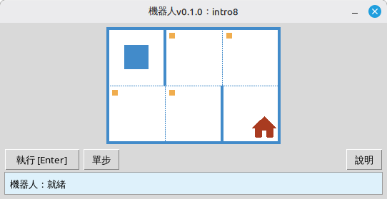

[English](../README.md) | [Русский](./readme_ru.md) | [Беларуская](./readme_be.md) | [Українська](./readme_uk.md) | [Polski](./readme_pl.md) | [Deutsch](./readme_de.md) | [Español](./readme_es.md) | [Français](./readme_fr.md) | [Português](./readme_pt.md) | [简体中文](./readme_zh-hans.md) | [繁體中文](./readme_zh-hant.md) | [日本語](./readme_ja.md) | [한국어](./readme_ko.md) | [العربية](./readme_ar.md)

# 機器人

本專案是一個用於學習程式設計與演算法基礎的教學用**機器人**模擬器。學生編寫簡短的 Python 程式，控制機器人在格狀場地上移動、著色格子、讀取環境狀態，並完成小型課題，同時透過桌面視窗獲得即時的視覺回饋。

面向**學生**以及所有程式設計初學者，在友善的遊戲式環境中練習順序、迴圈、條件以及簡單問題的求解。

## 範例：課題 `intro8`



**課題：**將機器人移動到有房子的格子上，並沿路著色所有標記為待著色的格子。

Python 範例解答：

```python
from robot import *

task("intro8")

move_down()
paint()
move_right()
paint()
move_up()
paint()
move_right()
paint()
move_down()
```

## 機器人指令

**move_right()**  
將機器人向右移動一格。

**move_left()**  
將機器人向左移動一格。

**move_up()**  
將機器人向上移動一格。

**move_down()**  
將機器人向下移動一格。

**paint()**  
給目前格子著色。

**is_free_left()**  
若左側沒有牆則返回 True。

**is_free_right()**  
若右側沒有牆則返回 True。

**is_free_up()**  
若上方沒有牆則返回 True。

**is_free_down()**  
若下方沒有牆則返回 True。

**is_wall_left()**  
若左側有牆則返回 True。

**is_wall_right()**  
若右側有牆則返回 True。

**is_wall_up()**  
若上方有牆則返回 True。

**is_wall_down()**  
若下方有牆則返回 True。

**is_cell_painted()**  
若目前格子已著色則返回 True。

**is_cell_not_painted()**  
若目前格子未著色則返回 True。

**pol()**  
返回目前格子的污染值。

**printn(value)**  
在目前格子中顯示整數。

## 可用於 `task()` 的課題

**入門**  
intro1, ..., intro24

**函數**  
fun1, ..., fun20

**「for」迴圈**  
for1, ..., for28

**「for」迴圈與函數**  
forfun1, ..., forfun9

**「while」迴圈**  
w1, ..., w51

**「while」迴圈與函數**  
wfun1, ..., wfun12

**「if」陳述式**  
if1, ..., if14

**「while」迴圈與「if」**  
wif1, ..., wif13

**「if」和「else」**  
ifelse1, ..., ifelse12

**複合條件**  
compound1, ..., compound11

## 使用分發套件

1. 從 **[GitHub Releases](https://github.com/step-in-dev/robot/releases)** 頁面下載模組壓縮檔。
2. 將壓縮檔解壓縮到學生的工作資料夾中。
3. 將解答檔案儲存在 `robot` 套件旁邊。以壓縮檔中的 **`sample_solution.py`** 作為起點。
4. 若要執行其他練習，請變更傳遞給 **`task()`** 的字串（參見上方的 **可用於 `task()` 的課題** 一節）。

需求：**Python 3** 及標準程式庫（介面使用 `tkinter`，大多數桌面系統的 Python 安裝中均包含該程式庫）。
